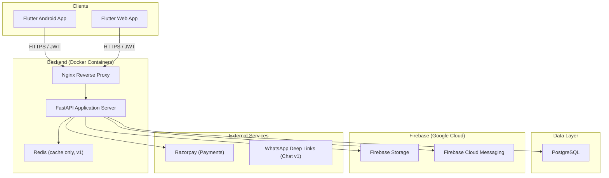
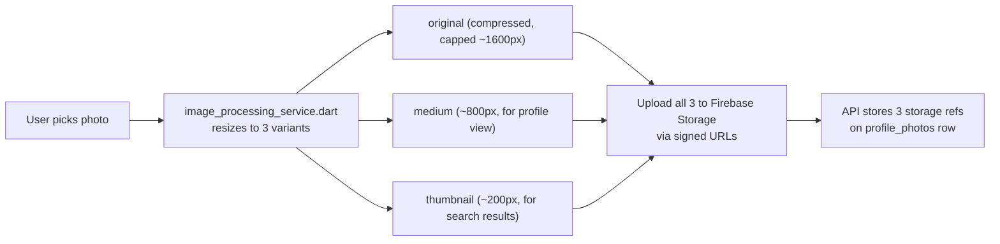
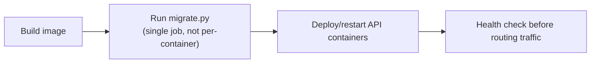
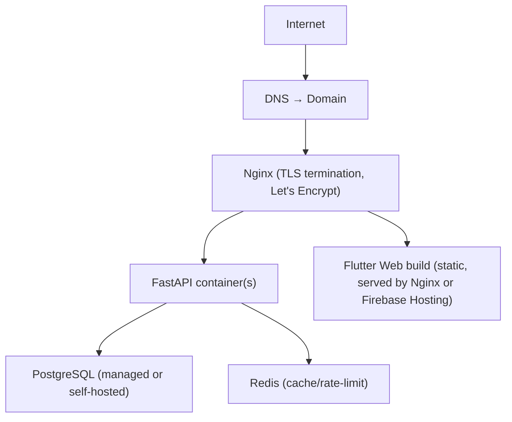
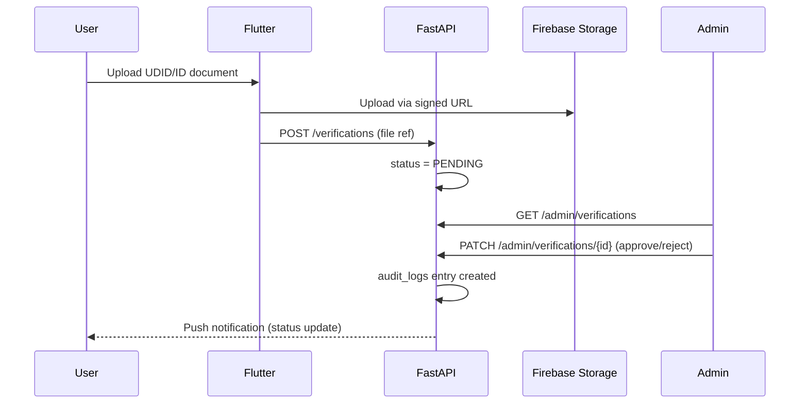
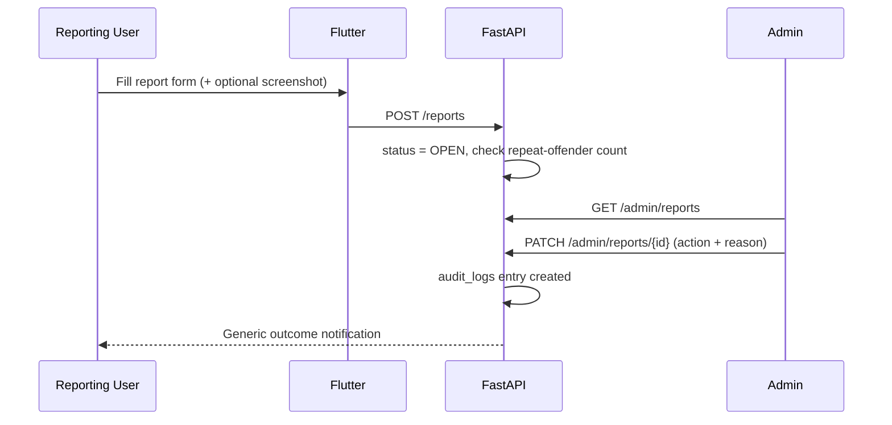

# Divyang Matrimony — System Architecture

> **Version:** 2.0
> **Date:** 2026-07-31
> **Status:** Design — Pre-Implementation
> **Changelog from v1.0:** Riverpod replaces BLoC · matching simplified to live SQL filters (no Celery/background precompute) · CMS deferred, static pages hardcoded · Celery removed for v1 in favor of FastAPI BackgroundTasks + lightweight scheduler · client-side image resizing replaces server-side pipeline · added Analytics, ADRs, sequence diagrams, request lifecycle, environment strategy, deployment architecture, audit tables, backup/recovery, account protection, simplified 3-tier admin roles, design tokens, offline strategy, standard API response format

---

## Table of Contents

1. [High-Level Architecture](#1-high-level-architecture)
2. [Flutter Structure](#2-flutter-structure)
3. [Backend Structure](#3-backend-structure)
4. [Feature Modules](#4-feature-modules)
5. [Database](#5-database)
6. [API Structure](#6-api-structure)
7. [Security](#7-security)
8. [Data Privacy](#8-data-privacy)
9. [Accessibility](#9-accessibility)
10. [Admin Panel](#10-admin-panel)
11. [Testing & Quality](#11-testing--quality)
12. [CI/CD & Observability](#12-cicd--observability)
13. [Scalability](#13-scalability)
14. [Future Expansion — Multi-Platform Reuse](#14-future-expansion--multi-platform-reuse)
15. [Analytics](#15-analytics)
16. [Environment Strategy](#16-environment-strategy)
17. [Deployment Architecture](#17-deployment-architecture)
18. [Request Lifecycle](#18-request-lifecycle)
19. [Sequence Diagrams — Critical Flows](#19-sequence-diagrams--critical-flows)
20. [Architecture Decision Records](#20-architecture-decision-records)

---

## 1. High-Level Architecture

### 1.1 System Overview

Three-tier client–server system: Flutter clients (Android APK + Flutter Web) talk HTTPS to a FastAPI backend, which owns all business logic and persistence. Firebase provides object storage and push notifications only — never the source of truth for domain data.

### 1.2 Component Diagram



**v1 simplification:** No Celery, no dedicated worker container. `Redis` in v1 exists only for rate-limit counters and short-lived caching — not as a task broker. See Section 3.7 for what replaces Celery, and Section 13 for when to reintroduce it.

### 1.3 Key Architecture Decisions

| Decision | Rationale |
|---|---|
| **PostgreSQL as single source of truth** | Avoids Firestore–Postgres sync issues |
| **Firebase only for blobs + push** | Uses Firebase for what it's cheap and reliable at |
| **No Celery/Redis-broker in v1** | Removes an entire infra component (Redis-as-broker, worker container, task monitoring) that has no real workload yet. FastAPI `BackgroundTasks` + a lightweight in-process scheduler cover v1 needs. See ADR-007. |
| **WhatsApp deep-link for v1 chat** | Reduces v1 scope; target demographic already lives on WhatsApp |
| **Riverpod for state management** | Less boilerplate than BLoC, compile-time-safe DI, easier unit testing without a mock event/state pair per feature — better fit for a solo/small team. See ADR-008. |
| **Live SQL filters for v1 matching, not precomputed suggestions** | No background compute needed; simpler to reason about and debug. See Section 4.5 and ADR-009. |
| **Single codebase, `platform_id` for multi-platform** | A column is cheaper than a cluster at this scale |

---

## 2. Flutter Structure

### 2.1 Folder Tree

```
lib/
├── main.dart
├── main_dev.dart
├── main_prod.dart
├── app.dart                           # ProviderScope + MaterialApp/GoRouter root
│
├── core/
│   ├── constants/
│   ├── errors/
│   │   ├── failures.dart
│   │   └── exceptions.dart
│   ├── network/
│   │   ├── api_client.dart
│   │   ├── network_info.dart
│   │   └── api_interceptors.dart
│   └── utils/
│
├── config/
│   ├── env/
│   │   ├── env_config.dart
│   │   └── flavor.dart
│   └── app_config.dart
│
├── routing/
│   ├── app_router.dart                # go_router, reads Riverpod auth state
│   ├── route_names.dart
│   └── guards/
│
├── theme/
│   ├── app_theme.dart
│   ├── design_tokens.dart             # Colors, typography, spacing, radius, elevation — see 2.5
│   ├── app_colors.dart
│   ├── app_typography.dart
│   └── high_contrast_theme.dart
│
├── l10n/
│
├── shared/
│   ├── widgets/
│   │   ├── accessible_button.dart
│   │   ├── accessible_text_field.dart
│   │   ├── profile_card.dart
│   │   ├── cached_network_image_wrapper.dart  # offline/caching-aware image widget
│   │   └── ...
│   └── extensions/
│
├── services/
│   ├── firebase/
│   │   ├── storage_service.dart
│   │   └── fcm_service.dart
│   ├── local_storage/
│   │   └── secure_storage_service.dart
│   ├── image_processing_service.dart  # client-side resize: original/medium/thumbnail — see 4.2
│   ├── connectivity_service.dart      # network detection for offline strategy — see 2.6
│   └── analytics_service.dart         # event tracking abstraction — see Section 15
│
├── models/
│   ├── user_model.dart
│   ├── profile_model.dart
│   └── enums/
│       ├── disability_type.dart
│       ├── profile_managed_by.dart
│       └── ...
│
├── repositories/
│   ├── auth_repository.dart           # abstract contract
│   ├── impl/
│   │   └── auth_repository_impl.dart
│   └── providers/                     # Riverpod providers exposing repositories
│       └── repository_providers.dart
│
└── features/
    ├── auth/
    │   ├── presentation/
    │   │   ├── screens/
    │   │   └── providers/             # Riverpod: auth_provider.dart (AsyncNotifier)
    │   ├── domain/
    │   │   ├── usecases/
    │   │   └── entities/
    │   └── data/
    │       ├── datasources/
    │       └── models/
    │
    ├── profile/  (presentation/domain/data, same pattern)
    ├── partner_preferences/
    ├── search/
    ├── matching/
    ├── interests/
    ├── chat/                          # v1: WhatsApp handoff only
    ├── notifications/
    ├── payments/
    ├── settings/
    └── reports/
```

Each feature keeps Clean Architecture (presentation/domain/data) — Riverpod changes *how state is exposed to the UI*, not the layer boundaries.

### 2.2 Family-Managed vs Self-Managed Profile

Unchanged from v1 design: single `profile_managed_by` enum field, single wizard flow, no separate UI paths. See v1 rationale (retained).

> **Open decision, not yet resolved:** when `managed_by != SELF`, does the WhatsApp handoff (Section 4.6) go to the account holder's number (the parent) or does the profile need an optional secondary phone for the person being matched? This changes product behavior, not just architecture, and should be settled before building the chat handoff screen.

### 2.3 State Management — Riverpod

**Why Riverpod over BLoC** (see ADR-008 for full record):
- No event/state boilerplate per feature — a `AsyncNotifierProvider` replaces a Bloc + Event + State trio for most screens.
- Compile-time provider safety — typos in provider references fail at compile time, not runtime.
- Dependency injection is the provider graph itself — no separate `get_it` registration step.
- Testing: `ProviderContainer` + `overrideWith` makes mocking trivial without a separate mocking framework for state.
- Better fit for solo/small-team velocity — less ceremony per feature.

**Pattern:**
- `AsyncNotifierProvider` for anything hitting the network (profile, search, payments).
- Plain `Provider`/`StateProvider` for simple derived or local UI state (toggle, tab index).
- `ref.watch` in widgets; `ref.read` in callbacks — standard Riverpod discipline enforced in code review.

### 2.4 Dependency Injection

Riverpod's provider graph **is** the DI mechanism — no `get_it`/`injectable` needed. Repository implementations are exposed via providers in `repositories/providers/repository_providers.dart`, and features depend on the abstract repository provider, not the concrete implementation, preserving the Clean Architecture dependency rule.

### 2.5 Design System / Tokens

`theme/design_tokens.dart` centralizes:
- **Colors** — semantic tokens (`primary`, `surface`, `error`, `success`), not raw hex scattered across widgets.
- **Typography** — a fixed `TextTheme` scale; screens reference `Theme.of(context).textTheme.bodyLarge`, never a hardcoded `TextStyle(fontSize: 16)`.
- **Spacing** — an 8pt-based scale (`spacing.xs/sm/md/lg/xl`) used instead of magic numbers in `Padding`/`SizedBox`.
- **Border radius / elevation** — fixed values per component tier (card, button, dialog).
- **Icons** — a single icon set, referenced via a constants file, not mixed Material/custom ad hoc.

**Why this matters here specifically:** hardcoded UI values are exactly what makes the accessibility work in Section 9 (font scaling, high-contrast theme swap) expensive to retrofit. Tokens make the high-contrast theme a second value set, not a rewrite.

### 2.6 Offline Strategy

| Concern | Approach |
|---|---|
| **Cached images** | `cached_network_image` (or equivalent) wraps all profile photo rendering — thumbnails cached to disk, so re-viewing a profile doesn't re-fetch. |
| **Offline profile viewing** | Last-fetched "my profile" and recently viewed search results are cached locally (Riverpod state persisted via `shared_preferences`/Hive for lightweight cases). Full offline-first sync is **not** a v1 goal — this is read-cache only. |
| **Retry failed requests** | API client (Dio) has a retry interceptor for idempotent GET requests on transient network failure (exponential backoff, max 3 attempts). Mutations (POST/PATCH) are **not** auto-retried silently — user sees an explicit error and retry action, to avoid duplicate side effects. |
| **Network detection** | `connectivity_service.dart` surfaces online/offline state app-wide; UI shows a banner when offline rather than letting requests fail silently. |

---

## 3. Backend Structure

### 3.1 Project Layout

```
backend/
├── alembic/
├── alembic.ini
│
├── app/
│   ├── main.py
│   │
│   ├── core/
│   │   ├── config.py
│   │   ├── security.py
│   │   ├── dependencies.py
│   │   ├── database.py
│   │   ├── redis.py                   # cache + rate-limit only, v1
│   │   ├── scheduler.py               # APScheduler setup — see 3.7
│   │   ├── exceptions.py
│   │   ├── error_handlers.py
│   │   ├── middleware.py
│   │   ├── logging_config.py
│   │   └── response.py                # standard response envelope — see 3.8
│   │
│   ├── models/                        # SQLAlchemy ORM
│   │   ├── base.py                    # timestamps, soft-delete mixin — see 5.5
│   │   ├── user.py
│   │   ├── profile.py
│   │   ├── sensitive_profile_data.py
│   │   ├── partner_preference.py
│   │   ├── interest.py
│   │   ├── subscription.py
│   │   ├── payment.py
│   │   ├── notification.py
│   │   ├── report.py
│   │   ├── verification.py
│   │   ├── admin_user.py
│   │   ├── consent_log.py
│   │   ├── sensitive_data_access_log.py
│   │   ├── audit_log.py               # admin/system action audit — see 5.6
│   │   ├── login_history.py           # see 7.7
│   │   └── analytics_event.py         # see Section 15
│   │
│   ├── schemas/
│   ├── repositories/
│   ├── services/
│   │   ├── auth_service.py
│   │   ├── profile_service.py
│   │   ├── search_service.py
│   │   ├── matching_service.py        # simplified — see 4.5
│   │   ├── interest_service.py
│   │   ├── payment_service.py
│   │   ├── subscription_service.py
│   │   ├── notification_service.py
│   │   ├── verification_service.py
│   │   ├── report_service.py
│   │   ├── admin_service.py
│   │   ├── file_upload_service.py     # accepts pre-resized client images — see 4.2
│   │   ├── consent_service.py
│   │   └── analytics_service.py
│   │
│   ├── api/
│   │   ├── v1/
│   │   │   └── ... (as before, minus cms.py)
│   │   └── admin/
│   │       └── ... (minus cms.py in v1)
│   │
│   └── jobs/                          # replaces tasks/ (Celery) — see 3.7
│       ├── scheduled_jobs.py          # account-purge, expiry reminders
│       └── background_tasks.py        # FastAPI BackgroundTasks helpers
│
├── tests/
├── scripts/
│   ├── seed_data.py
│   ├── create_admin.py
│   └── migrate.py                     # standalone migration runner — see 12.1 note
│
├── Dockerfile
├── docker-compose.yml                 # API + Postgres + Redis (no worker container in v1)
├── pyproject.toml
├── .env.example
└── .env
```

### 3.2–3.6 (Config/DI/Errors/Logging/Validation)

Unchanged from v1 design — Pydantic `BaseSettings` for config, FastAPI `Depends()` for DI, structured exception → JSON error mapping, `structlog` JSON logging with redaction, Pydantic schema validation at the boundary. See v1.0 doc for full detail; nothing here required a change.

### 3.7 Why No Celery in v1 — and What Replaces It

**The gap this has to cover honestly:** dropping Celery isn't free. Two things in this system genuinely need scheduled execution, not just fire-and-forget:

| Need | v1 Solution | Why It's Enough for Now |
|---|---|---|
| **30-day account deletion purge** | `APScheduler` running in-process inside the FastAPI app (or a standalone cron-triggered script via `scripts/migrate.py`-style entry point), checking daily for accounts past their cooling-off window | Runs once a day, low volume, no need for distributed task queue machinery |
| **Subscription expiry reminders** | Same `APScheduler` job, daily batch query for subscriptions expiring in 3 days | Same reasoning |
| **Post-request side effects** (send a push after interest is created, log an analytics event) | `FastAPI BackgroundTasks` — attached to the request, runs after the response is sent, dies with the process if the server restarts mid-task | Acceptable for v1 volume; a lost "send push notification" on a rare server restart is not a correctness issue, unlike a lost payment webhook (which is handled synchronously + backed by Razorpay's own retry, not by this mechanism) |

**Multi-container caveat:** an in-process `APScheduler` runs once *per API container*. As soon as more than one container runs (Section 13), the daily purge and reminder jobs must be guarded by a PostgreSQL advisory lock (`pg_try_advisory_lock`) or moved to a single dedicated scheduler process, otherwise every container runs them concurrently.

**What this explicitly does NOT cover, and where the line is:** `BackgroundTasks` cannot survive a process restart and has no retry/visibility. If usage grows to the point of needing heavy async processing (bulk notification sends, resource-intensive background jobs) or a real job queue with retries and monitoring, **that is the trigger to introduce Redis-as-broker + Celery** — not before. See Section 13.2 for the explicit scale trigger.

### 3.8 Standard API Response Format

Every API response — success or error — follows one envelope, defined once in `core/response.py`:

```json
{
  "success": true,
  "message": "Profile updated successfully",
  "data": { "profile_id": "..." },
  "errors": null
}
```

Error case:

```json
{
  "success": false,
  "message": "Validation failed",
  "data": null,
  "errors": [
    { "field": "date_of_birth", "code": "INVALID_FORMAT", "message": "Expected DD/MM/YYYY" }
  ]
}
```

**Why this matters:** without a fixed envelope, every Flutter repository implementation ends up writing bespoke response-parsing logic per endpoint. One shape means one generic `ApiResponse<T>` parser on the client side.

---

## 4. Feature Modules

### 4.1 Authentication

Unchanged core design from v1 (phone+OTP primary, JWT access+refresh). See Section 7.7 for new account-protection additions (login attempt limits, device tracking, session management) layered onto this.

### 4.2 Profile — Image Handling (Revised)

**v1 approach: client-side resizing, not a server-side image pipeline.**

Instead of the API generating original/medium/thumbnail versions server-side (which would require background job infrastructure this doc just removed for v1), **Flutter resizes on-device before upload**:



**Why client-side, not server-side:**
- No backend job/worker needed — consistent with dropping Celery for v1.
- Smaller upload payloads over what's often patchy mobile data for this user base.
- `profile_photos` table gains `thumbnail_path` and `medium_path` columns alongside the existing `storage_path` (original). Columns hold Firebase **object paths**, never download URLs: the bucket is private and the backend issues short-lived signed read URLs after the viewer's privacy-tier check. Because resizing happens on the client, the server validates upload type/size, strips EXIF/GPS, and moderates all three variants.

**Rule enforced everywhere:** search results and list views load the `thumbnail_path` variant only (via signed URL) — **never** the original — full-resolution `original`/`medium` loads only on the single profile detail view.

Remainder of profile module (standard fields, sensitive fields, completeness score, moderation queue) unchanged from v1.0.

### 4.3 Partner Preferences

Unchanged from v1.0.

### 4.4 Search

Unchanged filter/redaction design. **Search backend note:** PostgreSQL full-text search (`tsvector`) for v1, ready to swap to **Meilisearch** if query complexity or latency outgrows Postgres — chosen over Elasticsearch specifically because it's far lighter to operate at this platform's expected scale (tens of thousands of profiles, not millions). See ADR-010.

### 4.5 Matching — Simplified for v1

**v1 approach: no background computation, no precomputed suggestion table.**

```
┌─────────────────────────────────────────────┐
│         Matching = Live SQL Query             │
│                                               │
│  On screen load, run partner-preference       │
│  filters directly against `profiles`:         │
│    1. Gender (hard filter)                    │
│    2. Age range (hard filter)                 │
│    3. Location (soft — ORDER BY proximity)    │
│    4. Disability compatibility (soft)         │
│    5. Religion (configurable hard/soft)       │
│                                               │
│  Sort: newest-first, or basic relevance        │
│  (count of soft-filter matches) — no ML,       │
│  no weighted scoring model.                    │
│                                               │
│  No `match_suggestions` table. No nightly      │
│  batch job. Query runs on-demand.              │
└─────────────────────────────────────────────┘
```

**This is the same endpoint as Search (Section 4.4)** with preferences pre-applied as default filters — "Suggestions" is not a separate computed artifact in v1, it's Search with the user's own partner preferences as the starting filter set.

**v2 path (unchanged intent from v1.0 doc):** once there's real interest-acceptance data to train on, a scoring layer can be inserted between the SQL filter step and the response — at that point, and only then, does background computation (and by extension Celery) get reintroduced, because scoring a large pool becomes too slow to run synchronously per request. This is the concrete trigger referenced in Section 13.2.

### 4.6 Chat — v1 WhatsApp Handoff

Unchanged from v1.0, including the acknowledged tradeoffs (no moderation, no paywall enforcement, no analytics on conversation content — mitigated by the WhatsApp-click **event** being logged, see Section 15).

> Still pending: the managed-by contact-ownership decision flagged in Section 2.2.

### 4.7 Notifications

Unchanged trigger table from v1.0. Delivery mechanism note: notification-sending is dispatched via `FastAPI BackgroundTasks` after the triggering request completes (e.g., after an interest is created), not via Celery — consistent with Section 3.7.

### 4.8–4.9 Payments & Subscription

Unchanged from v1.0 — Razorpay sandbox-first design, idempotency keys, webhook as backup confirmation path, full transaction logging. This logic runs synchronously in the request/webhook handler, not as a background job — payment state changes are too important to leave to a best-effort mechanism, which is exactly why `BackgroundTasks` was never used here even before this revision.

### 4.10 Admin

See Section 10 — now includes photo moderation queue (previously specified in 4.2 but missing from the admin panel entirely) and simplified 3-tier roles (Section 7.8).

### 4.11 Verification

Unchanged from v1.0.

### 4.12 Reports

Unchanged from v1.0, including the explicit off-platform harassment category.

### 4.13 Settings

Unchanged from v1.0, plus: "Logout from all devices" action (Section 7.7) and session list view.

### 4.14 Static Content — Hardcoded, No CMS (v1)

**About, Privacy Policy, Terms of Service, and FAQ are hardcoded** — either as static Flutter screens/markdown assets bundled with the app, or static routes served by the backend. No `cms_content` table, no admin CMS module, in v1.

**Trigger to build a CMS:** the moment a **non-developer** (support staff, founder without repo access) needs to edit this content without a code deploy. Until then, a CMS is solving a problem nobody has yet. When the trigger hits, the `cms_content` table design from v1.0 (with `platform_id` for multi-platform content) can be reintroduced without disrupting anything else — static content isn't referenced by foreign keys elsewhere.

---

## 5. Database

### 5.1 Entity Relationship Diagram

Same core schema as v1.0 (`users`, `profiles`, `sensitive_profile_data`, `partner_preferences`, `interests`, `payments`, `subscriptions`, `notifications`, `reports`, `verifications`, `consent_logs`, `sensitive_data_access_logs`, `profile_photos`), with these changes:

- **Removed:** `cms_content` (deferred, see 4.14), `match_suggestions` (removed, see 4.5 — matching is a live query, nothing to persist).
- **Added:** `audit_logs`, `login_history`, `active_sessions`, `otp_challenges`, `notification_preferences`, `platform_config`, `analytics_events` (see Database.md v2.1), `profile_photos.thumbnail_path` and `profile_photos.medium_path` columns (see 4.2).

### 5.2 Data Classification & Table Separation

Unchanged from v1.0 — `sensitive_profile_data` remains a separate, access-logged table with field-level encryption on free-text fields.

**Access-logging volume fix (carried over from prior review):** `sensitive_data_access_logs` only logs reads of `MATCHED`/`SUBSCRIBERS`/`PRIVATE`-tier fields, not the `PUBLIC`-tier `disability_type` shown in every search result. Logging every search-result view would generate one log row per profile per search — this was flagged as a self-inflicted write-volume problem and is fixed here at the design level, not left as an implementation footnote.

### 5.3 Indexes

Unchanged from v1.0, minus the `match_suggestions` index (table removed), plus:

| Table | Index | Type | Reason |
|---|---|---|---|
| `audit_logs` | `(actor_user_id, created_at DESC)` | Composite | Admin action history lookup |
| `login_history` | `(user_id, created_at DESC)` | Composite | Session/device history, suspicious login detection |
| `analytics_events` | `(event_type, created_at)` | Composite | Event-type querying for reporting |

### 5.4 `platform_id` Design

Unchanged from v1.0.

### 5.5 Soft Delete Strategy

Explicit per-table policy — this was previously implied, not stated:

| Table | Delete Strategy | Notes |
|---|---|---|
| `users` | **Soft delete** (`deleted_at`) | 30-day cooling-off before hard purge of PII (Section 8.7) |
| `profiles` | **Soft delete**, cascades with user | Same cooling-off window |
| `sensitive_profile_data` | **Soft delete**, cascades with profile | Purged at same time as profile |
| `profile_photos` | **Hard delete** | Storage cost; no compliance reason to retain deleted photos |
| `interests` | **Soft delete** (`is_dismissed` flag, not `deleted_at`) | Needed for matching history/analytics even if dismissed |
| `payments` | **Never deleted** | Anonymized after account deletion (Section 8.7), retained 7 years — financial regulation |
| `reports` | **Never deleted** | Retained for pattern detection across users |
| `verifications` | **Soft delete** for record, **hard delete** for the underlying document file at 90 days | Record kept for history; file removed per Section 8.7 |
| `notifications` | **Hard delete** after 90 days (scheduled job) | No compliance reason to retain indefinitely |
| `audit_logs`, `consent_logs` | **Never deleted** | Compliance/accountability requires permanence |

`base.py`'s soft-delete mixin (`deleted_at` nullable timestamp) is applied only to tables in the "Soft delete" rows above — not a blanket base-class default, to avoid accidentally soft-deleting tables that need hard deletion or permanence.

### 5.6 Audit Tables

Two distinct audit mechanisms, not to be confused with each other:

| Table | Tracks | Who's Audited |
|---|---|---|
| `sensitive_data_access_logs` (v1.0, unchanged) | Reads of sensitive profile fields | Any user viewing another user's data |
| `audit_logs` (new) | Admin/system actions with side effects | Admins — bans, verification decisions, report resolutions, manual subscription changes, broadcast notifications |
| `login_history` (new) | Authentication events | Any user — login success/failure, device/IP, logout |

`audit_logs` schema: `id`, `actor_user_id` (admin), `action_type` (`USER_BANNED`, `VERIFICATION_APPROVED`, `REPORT_RESOLVED`, `SUBSCRIPTION_EXTENDED`, ...), `target_type`, `target_id`, `reason` (free text, required for destructive actions), `metadata` (jsonb), `created_at`.

**Why this was missing before, and why it matters:** the v1.0 doc had a single `reviewed_by` FK column per action table (verifications, reports) — that tells you *who* but not *when across the whole system*, and gives no way to answer "show me everything Admin X did this week" or "was this ban reversed and by whom." For a platform serving a vulnerable population, wrongful admin action (a bad ban, a wrongful verification rejection) needs a real trail, not a single column.

---

## 6. API Structure

Unchanged endpoint list from v1.0, with these removals/additions:

- **Removed:** `/api/admin/cms/*` (deferred — see 4.14).
- **Added:**
  - `POST /api/v1/auth/login-admin` — separate admin login endpoint (previously missing entirely — flagged in prior review; admin accounts authenticate via email+password only, no OTP, since admins are internal staff with issued credentials, not self-registering phone users).
  - **Changed:** `POST /api/v1/auth/register` no longer creates a user. It only issues a REGISTER OTP challenge, and `POST /api/v1/auth/verify-otp` takes a `purpose` and creates the user on success (Section 19.1). I could not check the v1.0 login endpoint contract; it should follow the same `purpose = LOGIN` pattern.
  - `POST /api/v1/auth/logout-all` — revoke all refresh tokens for the current user (Section 7.7).
  - `GET /api/v1/auth/sessions` — list active sessions/devices for the current user.
  - `POST /api/v1/analytics/events` — client-side event ingestion (Section 15); also emitted server-side for events the client can't see (e.g., `SUBSCRIPTION_PURCHASED` confirmed via webhook).

All responses use the standard envelope from Section 3.8.

---

## 7. Security

Sections 7.1–7.6 unchanged from v1.0 (password hashing, JWT, rate limiting, input validation, secure uploads, transport security). Two additions:

### 7.7 Account Protection

| Mechanism | Design |
|---|---|
| **Login attempt limits** | 5 failed attempts per phone/email within 15 minutes → account temporarily locked (15 min), tracked via Redis counter, independent of the general auth rate limit (Section 7.2) which is IP-based — this one is account-based. |
| **Device tracking** | Each successful login records device fingerprint (user agent, rough device model if available) + IP in `login_history`. |
| **Suspicious login detection (v1, basic)** | Flag (not block) logins from a new device/location combination — surfaced to the user via notification ("New login from a new device") using data already in `login_history`. Full risk-scoring is a v2 concern. |
| **Session management** | Refresh tokens are enumerable per user (`GET /api/v1/auth/sessions`); each can be individually revoked. |
| **Logout from all devices** | `POST /api/v1/auth/logout-all` revokes every refresh token for the user — used after a password change or a reported account compromise. |

### 7.8 Admin Permission Levels

**Deliberately kept to 3 tiers for v1, not the 5-tier scheme sometimes proposed** — a solo/small team doesn't have distinct humans to fill "Super Admin / Moderator / Verification Staff / Support Executive" separately, and building+testing a 5-way permission matrix for roles nobody occupies yet is effort spent on infrastructure, not product:

| Role | Can Do |
|---|---|
| `SUPER_ADMIN` | Everything, including managing other admin accounts and platform config |
| `ADMIN` | Verification review, report resolution, user ban/unban, payment log viewing — day-to-day moderation |
| `SUPPORT` | Read-only user/payment lookup, manual subscription extension for support cases — cannot ban or approve/reject verification |

Enforced the same way as v1.0 (`require_role()` FastAPI dependency). Expand to finer-grained roles when the team actually has distinct people to put in them — the `role` column and dependency pattern already support adding more values later without a redesign.

---

## 8. Data Privacy

Unchanged from v1.0 in full — regulatory context (DPDP Act), data classification, field-level encryption approach, consent management, visibility controls, retention/deletion policy, third-party exposure table. The one operational fix carried in from prior review is captured in Section 5.2 (access-log volume).

---

## 9. Accessibility

Unchanged from v1.0 in full — phased rollout, semantic widget pattern, family-managed-profile UX implications. Section 2.5 (design tokens) in this revision directly supports the "retrofitting is expensive, tokens make it cheap" argument made in the original 9.4.

---

## 10. Admin Panel

Unchanged module list from v1.0, with two fixes:

- **Photo Moderation Queue** — added as an explicit module (was referenced in profile feature spec but had no admin surface in v1.0). List of pending photo uploads, approve/reject with reason, tied to `profile_photos.moderation_status`.
- **CMS module removed** for v1 (see Section 4.14) — static pages are not admin-editable yet.
- **Admin roles** reflect the 3-tier scheme (Section 7.8) — module visibility in the admin UI is gated by role (e.g., `SUPPORT` sees User lookup and Payments read-only, not Verification/Reports actions).

---

## 11. Testing & Quality

Same testing pyramid and framework choices as v1.0, with two updates:

- **Flutter unit tests** target Riverpod providers, not BLoCs — `ProviderContainer` + `overrideWith` replaces `bloc_test`'s event/state assertions.
- **Backend unit tests** for `matching_service.py` now test a stateless filter-and-sort function (no async task, no precompute) — simpler test surface than the v1.0 Celery-based design implied.

---

## 12. CI/CD & Observability

Same pipeline shape as v1.0, with one correction:

**Migrations are a separate deploy step, not an app-boot side effect.** The v1.0 doc had Alembic migrations run automatically on container startup — fine for a single container, but a race condition the moment there's more than one API container starting concurrently on deploy (multiple containers racing to apply the same migration). Fixed here: `scripts/migrate.py` runs once, as its own CI/CD pipeline step, **before** any API containers are started or restarted. Containers assume the schema is already current at boot and never attempt migrations themselves.



Observability (logging/Sentry/uptime) unchanged from v1.0.

---

## 13. Scalability

Unchanged scaling table from v1.0, with the Celery reintroduction trigger made explicit (previously implicit):

### 13.2 Concrete Trigger for Reintroducing Celery + Redis-as-Broker

| Signal | Action |
|---|---|
| Matching needs to move from live-query to precomputed/scored suggestions (Section 4.5 v2 path) | Reintroduce Celery for the batch scoring job |
| Notification volume grows past what `BackgroundTasks` can reliably handle within a single request lifecycle (e.g., broadcast to >10K users) | Move broadcast sending to a proper task queue |
| Scheduled jobs (Section 3.7) need retries, monitoring, or run longer than a few minutes | APScheduler is no longer sufficient; move to Celery Beat |

Until one of these is actually true, adding Celery is solving a problem the platform doesn't have yet.

---

## 14. Future Expansion — Multi-Platform Reuse

Unchanged from v1.0 in full — `platform_id` column approach, `platform_config`, rationale table against alternatives, migration path for adding a new platform. The CMS deferral (Section 4.14) means per-platform *static content* differences are hardcoded per Flutter build flavor for now, not database-driven — this gets folded into the `cms_content.platform_id` design (already specified in v1.0) once a CMS is actually built.

---

## 15. Analytics

### 15.1 Purpose

Distinct from `audit_logs` (admin accountability) and `sensitive_data_access_logs` (privacy compliance) — this is product/funnel visibility.

### 15.2 Events Tracked

| Event | Trigger Point |
|---|---|
| `USER_REGISTERED` | Registration complete |
| `PROFILE_CREATED` | Profile record created |
| `PROFILE_COMPLETED` | Completeness score crosses 100% |
| `SEARCH_PERFORMED` | Search query executed |
| `PROFILE_VIEWED` | Profile detail screen opened |
| `INTEREST_SENT` | Interest created |
| `INTEREST_ACCEPTED` | Mutual interest established |
| `WHATSAPP_CLICKED` | WhatsApp handoff link tapped (Section 4.6's mitigation for zero conversation visibility) |
| `SUBSCRIPTION_PURCHASED` | Payment verified + subscription activated |
| `REPORT_SUBMITTED` | Report filed |
| `VERIFICATION_APPROVED` | Admin approves verification |

### 15.3 Implementation

- **Client-side events** (`SEARCH_PERFORMED`, `PROFILE_VIEWED`, `WHATSAPP_CLICKED`) sent via `analytics_service.dart` → `POST /api/v1/analytics/events`, fire-and-forget, non-blocking.
- **Server-side events** (`SUBSCRIPTION_PURCHASED`, `VERIFICATION_APPROVED`) emitted directly by the relevant service after the authoritative state change — not trusted from the client.
- Stored in `analytics_events` (`id`, `user_id` nullable, `platform_id`, `event_type`, `metadata` jsonb, `created_at`).
- **v1 scope:** raw event log queried directly for admin dashboard metrics (Section 10). A dedicated analytics pipeline (e.g., exporting to a warehouse) is a v2 concern once event volume makes ad hoc SQL too slow.

---

## 16. Environment Strategy

| Environment | Purpose | Notes |
|---|---|---|
| **Development** | Local machine, individual developer | Local Postgres/Redis via `docker-compose`, `.env` with dev Firebase project, Razorpay sandbox keys |
| **Staging** | Pre-production verification | Mirrors production infra at smaller scale, separate Firebase project, Razorpay sandbox keys (never live keys), auto-deployed on merge to `main` |
| **Production** | Live users | Separate Firebase project, **live** Razorpay keys (once commercial), manual deploy trigger with approval (Section 12) |

**Per-environment config surface:**
- `DATABASE_URL`, `REDIS_URL` — different instance per environment
- Firebase config — separate project per environment (separate `google-services.json` / web config), never shared, so dev/staging testing never touches production storage or push tokens
- API base URL — Flutter build flavors (`main_dev.dart` / `main_prod.dart`) point at the corresponding backend
- Build flavors — `flutter build apk --flavor dev` / `--flavor prod`, each with distinct app ID suffix so dev and prod can be installed side by side on a test device

---

## 17. Deployment Architecture



- **Docker containers:** API container(s) + Postgres + Redis, orchestrated via `docker-compose` in v1 (single-host). Section 13 covers moving to multiple API containers behind the load balancer as load grows.
- **Reverse proxy:** Nginx handles TLS termination, HSTS, and routes `/api/*` to FastAPI, static assets to the Flutter Web build.
- **HTTPS/SSL:** Let's Encrypt certificates, auto-renewed via `certbot` cron.
- **Domain routing:** single domain, path-based split (`/api/*` vs static web app) — avoids needing separate subdomains/CORS complexity for v1.
- **Backups:** automated nightly `pg_dump` (or managed-provider automatic backups if using a hosted Postgres), retained 30 days rolling, stored off the API host (separate storage bucket). **Restore process documented and tested at least once before go-live** — an untested backup is not a real backup.
- **Disaster recovery:** RPO target of 24 hours (nightly backup), RTO target documented once hosting provider is finalized — this is a placeholder that must be filled in with real numbers before production launch, not left as "we have backups."

---

## 18. Request Lifecycle

```
Flutter (Riverpod provider triggers repository call)
      ↓
Dio API client (adds JWT header, request ID)
      ↓
Nginx (TLS termination, routes to FastAPI)
      ↓
FastAPI route handler (Pydantic request validation)
      ↓
Dependency layer (get_current_user, require_role/require_subscription)
      ↓
Service (business logic, raises domain exceptions on failure)
      ↓
Repository (SQLAlchemy query against PostgreSQL)
      ↓
Service (assembles response data)
      ↓
Route handler (wraps in standard envelope — Section 3.8)
      ↓
FastAPI BackgroundTasks (if any post-response side effect, e.g. push notification)
      ↓
Response → Flutter (repository parses envelope, updates Riverpod state)
```

Every hop after Nginx carries the same `request_id` (set in middleware) through logs — this is what makes tracing a single failed request across service/repository layers tractable in production.

---

## 19. Sequence Diagrams — Critical Flows

### 19.1 Registration & Login

**The `users` row is created only after the OTP is verified.** `POST /auth/register` just issues a challenge (stored in `otp_challenges`, Database.md §3.21), so abandoned sign-ups leave no unverified user rows. The challenge expires and is hard-deleted after 24 hours.

```mermaid
sequenceDiagram
    participant U as User
    participant App as Flutter
    participant API as FastAPI
    participant R as Redis
    participant DB as PostgreSQL
    participant SMS as SMS Gateway

    U->>App: Enter phone number
    App->>API: POST /auth/register (phone)
    API->>R: Check send limits (per phone, per IP)
    API->>DB: Consume any open REGISTER challenge, insert new otp_challenges row (HMAC of code)
    API->>SMS: Send OTP
    API-->>App: 200 generic "OTP sent" (no users row exists yet)
    SMS-->>U: SMS with OTP
    U->>App: Enter OTP, accept terms and privacy policy
    App->>API: POST /auth/verify-otp (phone, code, purpose=REGISTER, consent versions)
    API->>DB: BEGIN
    API->>DB: Validate code, expiry, attempts; set consumed_at
    alt no user for this phone
        API->>DB: Insert users (is_phone_verified = TRUE), consent_logs, active_sessions, login_history
    else user already exists
        API->>DB: Treat as login: active_sessions, login_history
    end
    API->>DB: COMMIT
    API-->>App: JWT access + refresh tokens (+ is_new_user)
```

**Rules for this flow:**

- **Single transaction at verify.** Consuming the challenge, creating the `users` row, writing `consent_logs` (the client sends the accepted terms/privacy versions with `verify-otp`), and creating the `active_sessions` and `login_history` rows commit together or not at all.
- **Wrong codes still count.** The `attempts` increment is committed in its own transaction so it persists even though the request returns an error. At `max_attempts` the challenge is dead and the user must request a new OTP.
- **No account enumeration.** `/auth/register` returns the same generic response whether or not the phone already has an account. If a verified REGISTER challenge finds an existing user, the flow completes as a login (`is_new_user = false`) rather than failing.
- **Concurrency.** Two simultaneous verifications for the same phone are serialized by the partial unique index on `users(phone, platform_id)`; the loser catches the integrity error and continues as a login.
- **Soft-deleted accounts.** The phone stays reserved during the 30-day cooling-off (Database.md §3.1), so verifying it routes into the account-restoration path, never into creating a second user.
- **Login (existing user)** uses the same challenge/verify mechanics with `purpose = LOGIN` and never creates a `users` row. For an unknown phone it returns the same generic response, sends no SMS, and `verify-otp` fails with the same generic invalid-or-expired error.
- **Resend** inserts a new challenge and consumes the open one in the same transaction (one open challenge per phone + purpose).
- **Rate limits** are Redis counters on send only (per phone, per IP; Sections 7.2, 7.7). Losing Redis loses throttling, not OTP correctness.
- **`platform_id`** always comes from the request's platform context, never from the client body.

### 19.2 Express Interest → WhatsApp Handoff

Unchanged from v1.0 (Section 1.3) — retained as-is; no logic change from this revision.

### 19.3 Subscription Purchase

Unchanged from v1.0 (Section 1.3 Payment Flow) — retained as-is.

### 19.4 Verification



### 19.5 Report User



---

## 20. Architecture Decision Records

Brief-form ADRs — enough to record *why*, not a full template. Expand individually if a decision is revisited.

**ADR-001: Flutter over React Native**
Single codebase for Android + Web is a hard requirement; Flutter's web support is more mature for a data-heavy CRUD-style app than RN's web story. Team also has existing Flutter familiarity.

**ADR-002: FastAPI over Django**
Async-native, Pydantic validation built in, lighter weight for an API-only backend (no need for Django's templating/admin-heavy conventions when the Flutter admin web app already covers the admin UI).

**ADR-003: PostgreSQL over MongoDB**
Domain data is inherently relational (users↔profiles↔preferences↔interests, with real joins for matching and search). Reaching for a document store here would mean re-implementing relational integrity in application code.

**ADR-004: WhatsApp handoff over in-app chat (v1)**
See Section 4.6 — reduces v1 scope significantly; explicit tradeoffs (no moderation, no paywall enforcement on chat) accepted and mitigated via `WHATSAPP_CLICKED` analytics event and an off-platform report category. Revisit when subscription revenue justifies building real-time chat infra.

**ADR-005: Firebase Storage over AWS S3**
Google Cloud already in use for FCM; one vendor relationship instead of two for storage+push. `file_upload_service.py`'s abstraction keeps this swappable if storage costs become prohibitive at scale (Section 13.2).

**ADR-006: Monolith over microservices**
At the expected scale (tens of thousands of users, not millions), microservices add operational and debugging complexity with no corresponding benefit. Revisit only past the triggers named in Section 13.4.

**ADR-007: No Celery/Redis-broker in v1**
See Section 3.7 in full. FastAPI `BackgroundTasks` + `APScheduler` cover v1's actual async needs (post-response side effects, daily scheduled jobs). Celery is reintroduced only when one of the concrete triggers in Section 13.2 is hit — not preemptively.

**ADR-008: Riverpod over BLoC**
Less boilerplate per feature, compile-time-safe provider references, DI is the provider graph itself (no separate `get_it` registration), simpler unit testing via `ProviderContainer`. Better fit for a solo/small-team build velocity than BLoC's event/state ceremony.

**ADR-009: Live SQL filtering over precomputed match scoring (v1)**
See Section 4.5. No background compute needed; matching and search share one code path. Revisit when there's enough interest-acceptance data to justify a scoring model — at that point batch precomputation (and Celery, per ADR-007) becomes worth the added complexity.

**ADR-010: Meilisearch (future) over Elasticsearch**
If PostgreSQL full-text search outgrows the platform's needs, Meilisearch is the planned next step over Elasticsearch — significantly lighter to operate (single binary, minimal tuning) and well-matched to a profile-count in the tens of thousands rather than the millions-plus scale Elasticsearch is built for.

---

## Appendix A: Technology Summary

| Layer | Technology | Version (Target) |
|---|---|---|
| Mobile Client | Flutter (Android) | 3.x (latest stable) |
| Web Client | Flutter Web | Same codebase |
| State Management | **Riverpod** | 2.x |
| Routing (Flutter) | go_router | Latest |
| Backend Framework | FastAPI | 0.110+ |
| ORM | SQLAlchemy (async) | 2.x |
| Database | PostgreSQL | 16 |
| Migrations | Alembic (standalone deploy step) | Latest |
| Cache / Rate-limit | Redis | 7.x |
| Scheduled jobs (v1) | **APScheduler** (in-process) | Latest |
| Async side-effects (v1) | **FastAPI BackgroundTasks** | Built-in |
| Object Storage | Firebase Storage | Latest SDK |
| Push Notifications | Firebase Cloud Messaging | Latest SDK |
| Payments | Razorpay (Python SDK, sandbox mode) | Latest |
| Search (v1 → future) | PostgreSQL full-text → **Meilisearch** | — |
| Containerization | Docker + Docker Compose | Latest |
| Error Tracking | Sentry | Latest SDK |
| CI/CD | GitHub Actions | N/A |

## Appendix B: Glossary

(Unchanged from v1.0 — see original terms: Managed-by profile, DPDP Act, UDID, Idempotency key, Platform ID, Soft filter, Hard filter.)

---

> **End of Architecture Document — v2.0**
