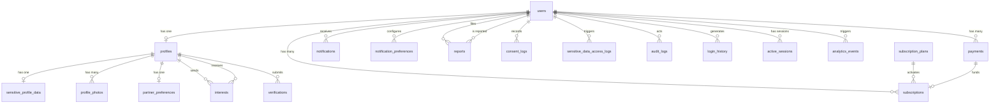

# Divyang Matrimony — Database Design

> **Source of Truth:** [Architecture.md](file:///c:/Prakrut/Matrimony/Architecture.md) v2.0
> **Database:** PostgreSQL 16
> **ORM:** SQLAlchemy 2.x (async) + Alembic migrations
> **Date:** 2026-10-03
> **Version:** 2.1 — fixes the duplicate `notification_type_enum`, the hard-purge FK conflicts, platform-default hardcoding, storage URLs vs paths, and adds `otp_challenges`. See §8 for the full change log.

---

## Table of Contents

1. [Entity Relationship Diagram](#1-entity-relationship-diagram)
2. [PostgreSQL Enum Types](#2-postgresql-enum-types)
3. [Table Definitions](#3-table-definitions)
4. [Index Catalog](#4-index-catalog)
5. [Soft-Delete & Retention Strategy](#5-soft-delete--retention-strategy)
6. [Data Privacy Classification](#6-data-privacy-classification)
7. [Design Decisions](#7-design-decisions)
8. [Change Log](#8-change-log-v20--v21)

---

## 1. Entity Relationship Diagram



`otp_challenges` is standalone too (registration OTPs exist before a `users` row does). `platform_config` is a standalone reference table (keyed by `platform_key`), not tied by FK to any other table — every `platform_id` column across the schema is expected to match a `platform_key` here at the application layer.

### Table List (21 tables)

| # | Table | Architecture Ref | Category |
|---|---|---|---|
| 1 | `users` | §4.1, §7.7 | Core |
| 2 | `profiles` | §4.2 | Core |
| 3 | `sensitive_profile_data` | §5.2, §8.3 | Core (PII-separated) |
| 4 | `profile_photos` | §4.2, §10 | Core |
| 5 | `partner_preferences` | §4.3 | Core |
| 6 | `interests` | §4.5 | Engagement |
| 7 | `subscription_plans` | §4.9 | Commerce |
| 8 | `subscriptions` | §4.9 | Commerce |
| 9 | `payments` | §4.8 | Commerce |
| 10 | `notifications` | §4.7 | Platform |
| 11 | `notification_preferences` | §4.13 | Platform |
| 12 | `reports` | §4.12 | Platform |
| 13 | `verifications` | §4.11 | Platform |
| 14 | `consent_logs` | §8.5 | Compliance |
| 15 | `sensitive_data_access_logs` | §5.2, §5.6 | Compliance |
| 16 | `audit_logs` | §5.6 | Compliance |
| 17 | `login_history` | §7.7 | Security |
| 18 | `active_sessions` | §7.7 | Security |
| 19 | `analytics_events` | §15 | Analytics |
| 20 | `platform_config` | §14.2 | Multi-Platform |
| 21 | `otp_challenges` | §4.1, §19.1 | Security |

---

## 2. PostgreSQL Enum Types

Each enum is a native PostgreSQL `CREATE TYPE ... AS ENUM`. Using database-level enums instead of application-side strings gives column-level type safety and prevents invalid values at the storage layer.

```sql
-- Core domain
CREATE TYPE gender_enum AS ENUM ('MALE', 'FEMALE', 'OTHER');
CREATE TYPE profile_managed_by_enum AS ENUM ('SELF', 'PARENT', 'SIBLING', 'GUARDIAN');
CREATE TYPE disability_type_enum AS ENUM ('PHYSICAL', 'VISUAL', 'HEARING', 'INTELLECTUAL', 'MULTIPLE');
CREATE TYPE marital_status_enum AS ENUM ('NEVER_MARRIED', 'DIVORCED', 'WIDOWED', 'SEPARATED');

-- Engagement
CREATE TYPE interest_status_enum AS ENUM ('PENDING', 'ACCEPTED', 'REJECTED');

-- Commerce
-- CAPTURED is the authoritative terminal success state used by subscription-activation logic.
-- Architecture §4.8 uses 'captured' and 'success' interchangeably in prose; CAPTURED is the
-- canonical value here. AUTHORIZED means funds reserved but not yet settled (used by some
-- Razorpay flows); CAPTURED = payment settled = subscription can activate.
CREATE TYPE payment_status_enum AS ENUM ('CREATED', 'AUTHORIZED', 'CAPTURED', 'FAILED', 'REFUNDED');
CREATE TYPE subscription_tier_enum AS ENUM ('FREE', 'BASIC', 'PREMIUM');

-- Notifications (§4.7, §4.13)
CREATE TYPE notification_type_enum AS ENUM (
    'INTEREST_RECEIVED',
    'INTEREST_ACCEPTED',
    'INTEREST_REJECTED',
    'MUTUAL_INTEREST',
    'VERIFICATION_APPROVED',
    'VERIFICATION_REJECTED',
    'SUBSCRIPTION_ACTIVATED',
    'SUBSCRIPTION_EXPIRING',
    'SUBSCRIPTION_EXPIRED',
    'NEW_DEVICE_LOGIN',
    'PROFILE_PHOTO_APPROVED',
    'PROFILE_PHOTO_REJECTED',
    'ACCOUNT_BANNED',
    'REPORT_STATUS_UPDATE',
    'ADMIN_BROADCAST'
);

-- Platform
CREATE TYPE verification_type_enum AS ENUM ('IDENTITY', 'DISABILITY_CERTIFICATE');
CREATE TYPE verification_status_enum AS ENUM ('PENDING', 'APPROVED', 'REJECTED');
-- Profile-level aggregate. UNVERIFIED = nothing submitted yet (distinct from PENDING = under review).
CREATE TYPE profile_verification_status_enum AS ENUM ('UNVERIFIED', 'PENDING', 'APPROVED', 'REJECTED');
CREATE TYPE report_category_enum AS ENUM (
    'FAKE_PROFILE', 'INAPPROPRIATE_CONTENT', 'HARASSMENT',
    'OFF_PLATFORM_HARASSMENT', 'SCAM', 'OTHER'
);
CREATE TYPE report_status_enum AS ENUM ('OPEN', 'UNDER_REVIEW', 'RESOLVED', 'DISMISSED');

-- Moderation
CREATE TYPE moderation_status_enum AS ENUM ('PENDING', 'APPROVED', 'REJECTED');

-- Security
CREATE TYPE admin_role_enum AS ENUM ('SUPER_ADMIN', 'ADMIN', 'SUPPORT');
CREATE TYPE login_event_type_enum AS ENUM ('LOGIN_SUCCESS', 'LOGIN_FAILED', 'LOGOUT', 'TOKEN_REFRESH');
CREATE TYPE otp_purpose_enum AS ENUM ('REGISTER', 'LOGIN');

-- Compliance
CREATE TYPE consent_type_enum AS ENUM ('TERMS_OF_SERVICE', 'PRIVACY_POLICY', 'DATA_PROCESSING', 'MARKETING');

-- Analytics (§15.2)
CREATE TYPE analytics_event_type_enum AS ENUM (
    'USER_REGISTERED', 'PROFILE_CREATED', 'PROFILE_COMPLETED',
    'SEARCH_PERFORMED', 'PROFILE_VIEWED',
    'INTEREST_SENT', 'INTEREST_ACCEPTED',
    'WHATSAPP_CLICKED',
    'SUBSCRIPTION_PURCHASED',
    'REPORT_SUBMITTED', 'VERIFICATION_APPROVED'
);

-- Audit (§5.6)
CREATE TYPE audit_action_type_enum AS ENUM (
    'USER_BANNED', 'USER_UNBANNED',
    'VERIFICATION_APPROVED', 'VERIFICATION_REJECTED',
    'REPORT_RESOLVED', 'REPORT_DISMISSED',
    'SUBSCRIPTION_EXTENDED', 'SUBSCRIPTION_CANCELLED',
    'ADMIN_CREATED', 'ADMIN_DEACTIVATED',
    'PHOTO_APPROVED', 'PHOTO_REJECTED',
    'NOTIFICATION_BROADCAST'
);
```

> [!NOTE]
> Enums are extensible via `ALTER TYPE ... ADD VALUE`. Adding a value is a non-breaking online change in PostgreSQL. Removing or renaming values requires a migration that creates a new type.

---

## 3. Table Definitions

### Conventions

- **Primary keys:** `UUID` (v4), `DEFAULT gen_random_uuid()` (built into PostgreSQL 13+, so no `uuid-ossp` extension is needed); Python `uuid.uuid4()` is equally fine application-side.
- **Timestamps:** `TIMESTAMPTZ` (UTC), auto-set via defaults.
- **Soft delete:** `deleted_at TIMESTAMPTZ NULL` — only on tables listed in §5.5. Not a blanket default.
- **`platform_id`:** `VARCHAR(50) NOT NULL`, **no default** — present on every row that is platform-scoped (§5.4, §14). The service layer always sets it explicitly from the request's platform context; a column default would silently tag rows as Divyang if a code path forgot to. References `platform_config.platform_key` at the application layer (no DB-level FK, to avoid coupling every table's insert order to `platform_config` existing first — this is a soft/logical reference, validated in the service layer).
- **Foreign keys:** `ON DELETE` behavior varies per relationship — documented per column.
- **Partial unique shorthand:** constraints written as `UNIQUE (...) WHERE ...` in this document are implemented as `CREATE UNIQUE INDEX ... WHERE ...` (SQLAlchemy: `Index(..., unique=True, postgresql_where=...)`) — PostgreSQL does not allow `WHERE` on a table-level `UNIQUE` constraint.
- **Age/range validation:** Any platform-configurable numeric bound (minimum age, maximum age, etc.) is validated in the application layer against `platform_config.settings`, never as a hardcoded database `CHECK` constraint — see §7 Design Decisions for why.

---

### 3.1 `users`

The authentication/account table. One row per registered user (end user or admin). The profile, subscription, and all per-user data hang off this.

| Column | Type | Constraints | Notes |
|---|---|---|---|
| `id` | `UUID` | `PK, DEFAULT gen_random_uuid()` | |
| `platform_id` | `VARCHAR(50)` | `NOT NULL` | Multi-platform key (§14) |
| `phone` | `VARCHAR(15)` | `NULL` | Primary login identifier (E.164). NULL only for admin-only accounts |
| `email` | `VARCHAR(255)` | `NULL` | Optional for end users; required for admin accounts |
| `password_hash` | `VARCHAR(255)` | `NULL` | NULL for phone+OTP users; set for admin accounts |
| `role` | `admin_role_enum` | `NULL` | NULL = regular user; set for admin accounts (§7.8) |
| `is_active` | `BOOLEAN` | `NOT NULL, DEFAULT TRUE` | FALSE = deactivated by user or system |
| `is_banned` | `BOOLEAN` | `NOT NULL, DEFAULT FALSE` | Set by admin action (audit-logged) |
| `is_phone_verified` | `BOOLEAN` | `NOT NULL, DEFAULT FALSE` | Set `TRUE` when the row is created at successful `verify-otp` (Architecture §19.1), so it is always `TRUE` for end users; admin accounts (email + password, no phone) leave it `FALSE` |
| `is_email_verified` | `BOOLEAN` | `NOT NULL, DEFAULT FALSE` | Set after email verification (if applicable) |
| `last_login_at` | `TIMESTAMPTZ` | `NULL` | Updated on each successful login |
| `created_at` | `TIMESTAMPTZ` | `NOT NULL, DEFAULT NOW()` | |
| `updated_at` | `TIMESTAMPTZ` | `NOT NULL, DEFAULT NOW()` | |
| `deleted_at` | `TIMESTAMPTZ` | `NULL` | **Soft delete** — 30-day cooling-off (§5.5) |
| `anonymized_at` | `TIMESTAMPTZ` | `NULL` | Set by the hard-purge job. The row is kept as an anonymized tombstone (PII nulled) so FKs from retained tables stay valid (§5) |

**Constraints:**

```sql
UNIQUE (phone, platform_id) WHERE phone IS NOT NULL
    -- Deliberately includes soft-deleted rows: a number cannot be re-registered during
    -- the 30-day cooling-off (the owner can restore instead). It is freed when the purge
    -- job anonymizes the row (phone -> NULL).
UNIQUE (email, platform_id) WHERE email IS NOT NULL
    -- Same logic for email
CHECK (anonymized_at IS NOT NULL OR phone IS NOT NULL OR (role IS NOT NULL AND email IS NOT NULL))
    -- Every live account has either a phone (end user) or role+email (admin)
CHECK (anonymized_at IS NOT NULL OR role IS NULL OR (email IS NOT NULL AND password_hash IS NOT NULL))
    -- Admin accounts must have email + password (§6: login-admin uses email+password, not OTP)
```

> [!NOTE]
> **Tombstone, not delete.** The hard-purge job never deletes a `users` row. It nulls `phone`, `email`, `password_hash`, sets `is_active = FALSE` and `anonymized_at = NOW()`. Retained tables (`payments`, `reports`, `consent_logs`, `audit_logs`, `sensitive_data_access_logs`, `login_history`) keep valid FKs with no sentinel user and no FK exceptions. Push tokens live on `active_sessions` (§3.18), not here.

---

### 3.2 `profiles`

One-to-one with `users`. Contains all standard PII visible in the UI. Sensitive fields (disability details, health, religion) are in a separate table (§5.2).

| Column | Type | Constraints | Notes |
|---|---|---|---|
| `id` | `UUID` | `PK, DEFAULT gen_random_uuid()` | |
| `user_id` | `UUID` | `NOT NULL, UNIQUE, FK -> users.id ON DELETE CASCADE` | 1:1 relationship |
| `platform_id` | `VARCHAR(50)` | `NOT NULL` | |
| `managed_by` | `profile_managed_by_enum` | `NOT NULL, DEFAULT 'SELF'` | Who operates this account (§2.2) |
| `first_name` | `VARCHAR(100)` | `NOT NULL` | |
| `last_name` | `VARCHAR(100)` | `NOT NULL` | |
| `gender` | `gender_enum` | `NOT NULL` | |
| `date_of_birth` | `DATE` | `NOT NULL` | |
| `marital_status` | `marital_status_enum` | `NOT NULL` | |
| `height_cm` | `SMALLINT` | `NULL` | Height in centimeters |
| `education` | `VARCHAR(200)` | `NULL` | Highest qualification |
| `occupation` | `VARCHAR(200)` | `NULL` | Current occupation |
| `annual_income` | `VARCHAR(100)` | `NULL` | Range string, not exact amount |
| `mother_tongue` | `VARCHAR(50)` | `NULL` | |
| `languages_spoken` | `VARCHAR(255)` | `NULL` | Comma-separated |
| `city` | `VARCHAR(100)` | `NULL` | |
| `state` | `VARCHAR(100)` | `NULL` | |
| `country` | `VARCHAR(50)` | `NOT NULL, DEFAULT 'India'` | |
| `pincode` | `VARCHAR(10)` | `NULL` | Indian postal code |
| `bio` | `TEXT` | `NULL` | Free-text, max 500 chars (app-enforced) |
| `disability_type` | `disability_type_enum` | `NULL` | **PUBLIC tier** — shown in search results (§5.2). Nullable so platforms with `require_disability = false` (e.g. Senior Citizen Matrimony) can omit it. |
| `completeness_score` | `SMALLINT` | `NOT NULL, DEFAULT 0` | Computed on profile update; profiles < 40% excluded from search |
| `is_profile_visible` | `BOOLEAN` | `NOT NULL, DEFAULT TRUE` | User can hide profile from search |
| `verification_status` | `profile_verification_status_enum` | `NOT NULL, DEFAULT 'UNVERIFIED'` | Aggregate computed by `verification_service`: `APPROVED` when every type in `platform_config.settings.required_verifications` is approved; else `PENDING` if any submission is pending; else `REJECTED` if the latest submission of a required type was rejected; else `UNVERIFIED` |
| `search_vector` | `TSVECTOR` | `NULL` | Full-text search index, updated via trigger (§4.4) |
| `created_at` | `TIMESTAMPTZ` | `NOT NULL, DEFAULT NOW()` | |
| `updated_at` | `TIMESTAMPTZ` | `NOT NULL, DEFAULT NOW()` | |
| `deleted_at` | `TIMESTAMPTZ` | `NULL` | **Soft delete**, cascades with user |

**Constraints:**

```sql
CHECK (completeness_score >= 0 AND completeness_score <= 100)
```

> [!NOTE]
> **Validation note:** Minimum/maximum age (and whether `disability_type` is required) is enforced in the application layer, read from `platform_config.settings` for the profile's `platform_id` — not as a database `CHECK` constraint. This lets Divyang Matrimony (18+, disability required) and Senior Citizen Matrimony (55+, disability not required) share this exact table with different rules, without a schema change per platform.

---

### 3.3 `sensitive_profile_data`

Separated from `profiles` for data privacy (§5.2, §8.3). Contains fields that:
- Have restricted visibility (only shown to subscribers/matched profiles)
- Require field-level encryption (free-text disability/health details, and contact fields)
- Generate access logs when read (except PUBLIC-tier `disability_type`, which lives on `profiles`)

| Column | Type | Constraints | Notes |
|---|---|---|---|
| `id` | `UUID` | `PK, DEFAULT gen_random_uuid()` | |
| `profile_id` | `UUID` | `NOT NULL, UNIQUE, FK -> profiles.id ON DELETE CASCADE` | 1:1 with profiles |
| `disability_percentage` | `SMALLINT` | `NULL` | UDID percentage |
| `disability_details` | `TEXT` | `NULL` | **ENCRYPTED** — free-text description |
| `disability_since` | `VARCHAR(50)` | `NULL` | Birth / childhood / acquired |
| `mobility_aid` | `VARCHAR(200)` | `NULL` | Wheelchair, crutches, etc. |
| `health_conditions` | `TEXT` | `NULL` | **ENCRYPTED** — other health conditions |
| `religion` | `VARCHAR(100)` | `NULL` | |
| `caste` | `VARCHAR(100)` | `NULL` | |
| `sub_caste` | `VARCHAR(100)` | `NULL` | |
| `family_type` | `VARCHAR(50)` | `NULL` | Joint / Nuclear |
| `family_status` | `VARCHAR(50)` | `NULL` | Middle / Upper-Middle / Affluent |
| `father_occupation` | `VARCHAR(200)` | `NULL` | |
| `mother_occupation` | `VARCHAR(200)` | `NULL` | |
| `siblings` | `VARCHAR(200)` | `NULL` | Count and married/unmarried |
| `about_family` | `TEXT` | `NULL` | **ENCRYPTED** — free-text family description |
| `contact_phone` | `TEXT` | `NULL` | **ENCRYPTED** — visible only on mutual interest |
| `contact_email` | `TEXT` | `NULL` | **ENCRYPTED** — visible only on mutual interest |
| `whatsapp_number` | `TEXT` | `NULL` | **ENCRYPTED** — for WhatsApp handoff (§4.6) |
| `created_at` | `TIMESTAMPTZ` | `NOT NULL, DEFAULT NOW()` | |
| `updated_at` | `TIMESTAMPTZ` | `NOT NULL, DEFAULT NOW()` | |
| `deleted_at` | `TIMESTAMPTZ` | `NULL` | **Soft delete**, cascades with profile |

**Constraints:**

```sql
CHECK (disability_percentage IS NULL OR (disability_percentage >= 0 AND disability_percentage <= 100))
```

> [!IMPORTANT]
> **Field-level encryption:** `disability_details`, `health_conditions`, `about_family`, `contact_phone`, `contact_email`, `whatsapp_number` are encrypted at rest using application-level AES-256-GCM before writing to the database. The encryption key is stored in environment variables, not in the database. Columns are stored as `TEXT` — not a fixed-length `VARCHAR` — because base64-encoded AES-256-GCM ciphertext (nonce + tag + payload) is significantly longer than the original plaintext; a `VARCHAR(15)` sized for a raw phone number would truncate or fail on the encrypted value.
>
> **Ciphertext format (key rotation):** store `v1:<key_id>:<base64(nonce || ciphertext || tag)>`. The `key_id` prefix lets the app hold several keys at once, decrypt old rows with their original key, and re-encrypt lazily after a rotation without a flag-day migration. Never reuse a nonce under the same key (96-bit random nonces are fine at this volume).

---

### 3.4 `profile_photos`

Stores references to three image variants per photo (§4.2: client-side resizing). The files live in Firebase Storage; this table holds **object paths** (not URLs) and metadata.

| Column | Type | Constraints | Notes |
|---|---|---|---|
| `id` | `UUID` | `PK, DEFAULT gen_random_uuid()` | |
| `profile_id` | `UUID` | `NOT NULL, FK -> profiles.id ON DELETE CASCADE` | Many photos per profile |
| `storage_path` | `VARCHAR(500)` | `NOT NULL` | Object path of the original (~1600px) in Firebase Storage |
| `medium_path` | `VARCHAR(500)` | `NOT NULL` | Object path of the ~800px variant for profile detail view |
| `thumbnail_path` | `VARCHAR(500)` | `NOT NULL` | Object path of the ~200px variant for search results |
| `display_order` | `SMALLINT` | `NOT NULL, DEFAULT 0` | Sorting order; 0 = primary |
| `is_primary` | `BOOLEAN` | `NOT NULL, DEFAULT FALSE` | Exactly one per profile |
| `moderation_status` | `moderation_status_enum` | `NOT NULL, DEFAULT 'PENDING'` | Admin photo moderation queue (§10) |
| `rejection_reason` | `VARCHAR(500)` | `NULL` | Set when moderation_status = REJECTED |
| `created_at` | `TIMESTAMPTZ` | `NOT NULL, DEFAULT NOW()` | |

**Constraints:**

```sql
-- Only one primary photo per profile (partial unique)
UNIQUE (profile_id) WHERE is_primary = TRUE AND moderation_status != 'REJECTED'

-- Maximum 6 photos per profile (enforced in application layer, not DB constraint)
```

> [!NOTE]
> **No `deleted_at`** — profile photos use **hard delete** (§5.5). Firebase Storage files are also deleted. No compliance reason to retain deleted photos.

> [!IMPORTANT]
> **Paths, not URLs.** Firebase download URLs are long-lived and bypass server-side tier checks. The bucket is private; the backend issues a short-lived signed read URL per request, only after the viewer's privacy tier allows that variant (§6). Because variants are resized on the client, the server must not trust them: validate type/size on upload, strip EXIF/GPS, and moderate all three variants (a photo is never shown while `moderation_status != 'APPROVED'`).

---

### 3.5 `partner_preferences`

One-to-one with `profiles`. Stores the user's filter criteria for matching/search (§4.3, §4.5).

| Column | Type | Constraints | Notes |
|---|---|---|---|
| `id` | `UUID` | `PK, DEFAULT gen_random_uuid()` | |
| `profile_id` | `UUID` | `NOT NULL, UNIQUE, FK -> profiles.id ON DELETE CASCADE` | 1:1 with profiles |
| `preferred_gender` | `gender_enum` | `NULL` | Hard filter (§4.5) |
| `age_min` | `SMALLINT` | `NULL` | Hard filter |
| `age_max` | `SMALLINT` | `NULL` | Hard filter |
| `preferred_height_min_cm` | `SMALLINT` | `NULL` | Soft filter |
| `preferred_height_max_cm` | `SMALLINT` | `NULL` | Soft filter |
| `preferred_marital_statuses` | `marital_status_enum[]` | `NULL` | Array of acceptable statuses |
| `preferred_disability_types` | `disability_type_enum[]` | `NULL` | Soft filter — disability compatibility (§4.5) |
| `preferred_education` | `VARCHAR(200)` | `NULL` | Soft filter |
| `preferred_religion` | `VARCHAR(100)` | `NULL` | Configurable hard/soft (§4.5) |
| `religion_is_strict` | `BOOLEAN` | `NOT NULL, DEFAULT FALSE` | TRUE = hard filter on religion |
| `preferred_caste` | `VARCHAR(100)` | `NULL` | Soft filter |
| `preferred_city` | `VARCHAR(100)` | `NULL` | Soft — ORDER BY proximity |
| `preferred_state` | `VARCHAR(100)` | `NULL` | Soft filter |
| `preferred_mother_tongue` | `VARCHAR(50)` | `NULL` | Soft filter |
| `preferred_annual_income` | `VARCHAR(100)` | `NULL` | Range string |
| `created_at` | `TIMESTAMPTZ` | `NOT NULL, DEFAULT NOW()` | |
| `updated_at` | `TIMESTAMPTZ` | `NOT NULL, DEFAULT NOW()` | |

**Constraints:**

```sql
CHECK (age_min IS NULL OR age_max IS NULL OR age_min <= age_max)
CHECK (preferred_height_min_cm IS NULL OR preferred_height_max_cm IS NULL
       OR preferred_height_min_cm <= preferred_height_max_cm)
```

> [!NOTE]
> **Fixed from v1.1:** `age_min >= 18` and `age_max <= 80` were previously hardcoded `CHECK` constraints here — the same platform-agnostic bug that `profiles.date_of_birth` had (§3.2). A Senior Citizen Matrimony user setting an age preference floor above 18, or a ceiling above 80, would have been silently rejected by the database regardless of what `platform_config` said. Removed: absolute bounds are now validated in the application layer against `platform_config.settings` for the profile's `platform_id`, same as §3.2. The only constraint that remains at the database level is internal consistency (`age_min <= age_max`), which is true for every platform and doesn't need per-platform configuration.

---

### 3.6 `interests`

Records interest expressions between profiles (§4.5). **Mutual** = a row with `status = ACCEPTED` exists in *either* direction (accepting a received interest makes the pair mutual immediately; there is no separate reverse row).

| Column | Type | Constraints | Notes |
|---|---|---|---|
| `id` | `UUID` | `PK, DEFAULT gen_random_uuid()` | |
| `from_profile_id` | `UUID` | `NOT NULL, FK -> profiles.id ON DELETE CASCADE` | Who sent the interest |
| `to_profile_id` | `UUID` | `NOT NULL, FK -> profiles.id ON DELETE CASCADE` | Who receives the interest |
| `status` | `interest_status_enum` | `NOT NULL, DEFAULT 'PENDING'` | |
| `message` | `VARCHAR(500)` | `NULL` | Optional personal message |
| `is_dismissed` | `BOOLEAN` | `NOT NULL, DEFAULT FALSE` | **Soft delete marker** (§5.5) — not `deleted_at` |
| `responded_at` | `TIMESTAMPTZ` | `NULL` | When status changed from PENDING |
| `platform_id` | `VARCHAR(50)` | `NOT NULL` | |
| `created_at` | `TIMESTAMPTZ` | `NOT NULL, DEFAULT NOW()` | |
| `updated_at` | `TIMESTAMPTZ` | `NOT NULL, DEFAULT NOW()` | |

**Constraints:**

```sql
UNIQUE (from_profile_id, to_profile_id)
    -- Prevent duplicate interests between the same pair
CHECK (from_profile_id != to_profile_id)
    -- Cannot send interest to self
```

> [!NOTE]
> **Crossing interests.** If A expresses interest in B while a `PENDING` row B→A exists, `interest_service` accepts the existing B→A row instead of inserting A→B. The mutual check is a lookup of both directions, each served by the unique index above. A `REJECTED` row blocks the same direction from being re-sent.

---

### 3.7 `subscription_plans`

Reference table for available plans. Rarely changes. Rows are inserted via seed data or admin.

| Column | Type | Constraints | Notes |
|---|---|---|---|
| `id` | `UUID` | `PK, DEFAULT gen_random_uuid()` | |
| `platform_id` | `VARCHAR(50)` | `NOT NULL` | Plans can vary per platform |
| `name` | `VARCHAR(100)` | `NOT NULL` | Display name ("Basic Plan") |
| `tier` | `subscription_tier_enum` | `NOT NULL` | FREE / BASIC / PREMIUM |
| `duration_days` | `INTEGER` | `NOT NULL` | Subscription duration |
| `price_paise` | `INTEGER` | `NOT NULL` | Price in paise (INR x 100) — avoids float |
| `features` | `JSONB` | `NOT NULL, DEFAULT '{}'` | Feature flags: max_interests_per_day, contact_reveal, etc. |
| `is_active` | `BOOLEAN` | `NOT NULL, DEFAULT TRUE` | FALSE = no longer available for purchase |
| `display_order` | `SMALLINT` | `NOT NULL, DEFAULT 0` | UI sorting |
| `created_at` | `TIMESTAMPTZ` | `NOT NULL, DEFAULT NOW()` | |
| `updated_at` | `TIMESTAMPTZ` | `NOT NULL, DEFAULT NOW()` | |

**Constraints:**

```sql
UNIQUE (platform_id, tier, duration_days) WHERE is_active = TRUE
    -- No two active plans with same tier+duration per platform
CHECK (price_paise >= 0)
CHECK (duration_days > 0)
```

---

### 3.8 `subscriptions`

Active/historical subscriptions per user. A user has at most one `is_active = TRUE` row at any time.

| Column | Type | Constraints | Notes |
|---|---|---|---|
| `id` | `UUID` | `PK, DEFAULT gen_random_uuid()` | |
| `user_id` | `UUID` | `NOT NULL, FK -> users.id ON DELETE CASCADE` | |
| `plan_id` | `UUID` | `NOT NULL, FK -> subscription_plans.id` | Which plan was purchased |
| `payment_id` | `UUID` | `NULL, FK -> payments.id` | NULL for FREE tier, set for paid |
| `tier` | `subscription_tier_enum` | `NOT NULL` | Denormalized from plan for fast access checks |
| `starts_at` | `TIMESTAMPTZ` | `NOT NULL` | |
| `expires_at` | `TIMESTAMPTZ` | `NOT NULL` | |
| `is_active` | `BOOLEAN` | `NOT NULL, DEFAULT TRUE` | Only one active per user |
| `cancelled_at` | `TIMESTAMPTZ` | `NULL` | If cancelled before expiry |
| `platform_id` | `VARCHAR(50)` | `NOT NULL` | |
| `created_at` | `TIMESTAMPTZ` | `NOT NULL, DEFAULT NOW()` | |
| `updated_at` | `TIMESTAMPTZ` | `NOT NULL, DEFAULT NOW()` | |

**Constraints:**

```sql
UNIQUE (user_id) WHERE is_active = TRUE
    -- At most one active subscription per user
CHECK (expires_at > starts_at)
```

> [!IMPORTANT]
> **Expiry is decided by time, not by the flag.** Access checks use `is_active AND expires_at > NOW()`. `is_active` is cleaned up by the daily job, so purchase/activation logic must, in the same transaction, set `is_active = FALSE` on any row for that user whose `expires_at` has passed *before* inserting the new active row — otherwise the partial unique index blocks a legitimate renewal until the job runs.

---

### 3.9 `payments`

Full transaction log for every Razorpay interaction (§4.8). **Never deleted** — anonymized after account deletion, retained 7 years per financial regulation.

| Column | Type | Constraints | Notes |
|---|---|---|---|
| `id` | `UUID` | `PK, DEFAULT gen_random_uuid()` | |
| `user_id` | `UUID` | `NOT NULL, FK -> users.id` | **No ON DELETE CASCADE** — payments survive user deletion |
| `idempotency_key` | `VARCHAR(100)` | `NOT NULL, UNIQUE` | Client-generated key to prevent duplicate payments |
| `razorpay_order_id` | `VARCHAR(100)` | `NULL, UNIQUE` | Set after Razorpay order creation |
| `razorpay_payment_id` | `VARCHAR(100)` | `NULL, UNIQUE` | Set after successful payment |
| `razorpay_signature` | `VARCHAR(255)` | `NULL` | Razorpay signature for verification |
| `amount_paise` | `INTEGER` | `NOT NULL` | Amount in paise (INR x 100) |
| `currency` | `VARCHAR(3)` | `NOT NULL, DEFAULT 'INR'` | |
| `status` | `payment_status_enum` | `NOT NULL, DEFAULT 'CREATED'` | `CAPTURED` is treated as the successful terminal payment state |
| `gateway_response` | `JSONB` | `NULL` | Full Razorpay callback response for audit |
| `plan_id` | `UUID` | `NOT NULL, FK -> subscription_plans.id` | Which plan this payment is for |
| `platform_id` | `VARCHAR(50)` | `NOT NULL` | |
| `created_at` | `TIMESTAMPTZ` | `NOT NULL, DEFAULT NOW()` | |
| `updated_at` | `TIMESTAMPTZ` | `NOT NULL, DEFAULT NOW()` | |

**Constraints:**

```sql
CHECK (amount_paise > 0)
-- No deleted_at: payments are NEVER deleted (§5.5)
-- user_id FK has NO ON DELETE CASCADE. On hard-purge the users row is kept as an
-- anonymized tombstone (§3.1), so this FK stays valid and no sentinel user is needed.
```

> [!WARNING]
> `user_id` on payments does NOT cascade on user deletion. When a user is hard-purged after the 30-day cooling-off period, the payment row is **kept** and points at the anonymized tombstone `users` row (§3.1). The purge job also scrubs payer PII (name, email, contact, card/VPA details) from `gateway_response`, keeping only order/payment IDs, amounts, status and timestamps. Never deleted: financial regulatory requirement.

---

### 3.10 `notifications`

In-app notifications and push history (§4.7). **Hard deleted** after 90 days by scheduled job.

| Column | Type | Constraints | Notes |
|---|---|---|---|
| `id` | `UUID` | `PK, DEFAULT gen_random_uuid()` | |
| `user_id` | `UUID` | `NOT NULL, FK -> users.id ON DELETE CASCADE` | |
| `type` | `notification_type_enum` | `NOT NULL` | e.g., INTEREST_RECEIVED, INTEREST_ACCEPTED, VERIFICATION_APPROVED, NEW_DEVICE_LOGIN |
| `title` | `VARCHAR(255)` | `NOT NULL` | Push notification title |
| `body` | `TEXT` | `NOT NULL` | Push notification body |
| `data` | `JSONB` | `NULL` | Deep-link payload (profile_id, etc.) |
| `is_read` | `BOOLEAN` | `NOT NULL, DEFAULT FALSE` | |
| `read_at` | `TIMESTAMPTZ` | `NULL` | |
| `created_at` | `TIMESTAMPTZ` | `NOT NULL, DEFAULT NOW()` | |

> [!NOTE]
> **No `deleted_at`** — notifications use **hard delete** after 90 days (§5.5), executed by the scheduled job in `scheduled_jobs.py`.

---

### 3.11 `notification_preferences`

Per-user, per-notification-type delivery toggles (§4.13). Previously missing from the schema entirely — Architecture Section 4.13 requires this and it wasn't represented until this revision.

| Column | Type | Constraints | Notes |
|---|---|---|---|
| `id` | `UUID` | `PK, DEFAULT gen_random_uuid()` | |
| `user_id` | `UUID` | `NOT NULL, FK -> users.id ON DELETE CASCADE` | |
| `notification_type` | `notification_type_enum` | `NOT NULL` | Which event this row configures |
| `push_enabled` | `BOOLEAN` | `NOT NULL, DEFAULT TRUE` | FCM push toggle |
| `email_enabled` | `BOOLEAN` | `NOT NULL, DEFAULT FALSE` | Email toggle (only relevant for types that support email, e.g. SUBSCRIPTION_EXPIRING) |
| `created_at` | `TIMESTAMPTZ` | `NOT NULL, DEFAULT NOW()` | |
| `updated_at` | `TIMESTAMPTZ` | `NOT NULL, DEFAULT NOW()` | |

**Constraints:**

```sql
UNIQUE (user_id, notification_type)
    -- One preference row per user per notification type — prevents duplicates
```

> [!NOTE]
> Rows are created lazily (on first explicit toggle) or seeded with defaults at registration — implementation detail for the service layer, not enforced at the schema level. Absence of a row for a given `(user_id, notification_type)` means "use the default" (`push_enabled = TRUE`, `email_enabled = FALSE`).

---

### 3.12 `reports`

User-filed reports (§4.12). **Never deleted** — retained for cross-user pattern detection.

| Column | Type | Constraints | Notes |
|---|---|---|---|
| `id` | `UUID` | `PK, DEFAULT gen_random_uuid()` | |
| `reporter_user_id` | `UUID` | `NOT NULL, FK -> users.id` | Who filed the report |
| `reported_user_id` | `UUID` | `NOT NULL, FK -> users.id` | Who is being reported |
| `category` | `report_category_enum` | `NOT NULL` | Includes `OFF_PLATFORM_HARASSMENT` (§4.12) |
| `description` | `TEXT` | `NOT NULL` | Free-text description |
| `evidence_paths` | `JSONB` | `NULL` | Array of Firebase Storage object paths (private; served to admins via signed URL only) |
| `status` | `report_status_enum` | `NOT NULL, DEFAULT 'OPEN'` | |
| `admin_notes` | `TEXT` | `NULL` | Internal notes from reviewing admin |
| `resolved_by` | `UUID` | `NULL, FK -> users.id` | Admin who resolved this |
| `resolved_at` | `TIMESTAMPTZ` | `NULL` | |
| `resolution_action` | `VARCHAR(100)` | `NULL` | e.g., WARNING_ISSUED, USER_BANNED, NO_ACTION |
| `platform_id` | `VARCHAR(50)` | `NOT NULL` | |
| `created_at` | `TIMESTAMPTZ` | `NOT NULL, DEFAULT NOW()` | |
| `updated_at` | `TIMESTAMPTZ` | `NOT NULL, DEFAULT NOW()` | |

**Constraints:**

```sql
CHECK (reporter_user_id != reported_user_id)
    -- Cannot report self
-- No deleted_at: reports are NEVER deleted (§5.5)
```

---

### 3.13 `verifications`

Identity/disability certificate verification submissions (§4.11). Soft delete for record; document files hard-deleted from Firebase at 90 days (§8.7).

| Column | Type | Constraints | Notes |
|---|---|---|---|
| `id` | `UUID` | `PK, DEFAULT gen_random_uuid()` | |
| `profile_id` | `UUID` | `NOT NULL, FK -> profiles.id ON DELETE CASCADE` | |
| `type` | `verification_type_enum` | `NOT NULL` | IDENTITY or DISABILITY_CERTIFICATE |
| `document_path` | `VARCHAR(500)` | `NOT NULL` | Firebase Storage object path of the uploaded document (private; admin-only signed URL, never returned to other users) |
| `status` | `verification_status_enum` | `NOT NULL, DEFAULT 'PENDING'` | |
| `reviewed_by` | `UUID` | `NULL, FK -> users.id` | Admin who reviewed |
| `reviewed_at` | `TIMESTAMPTZ` | `NULL` | |
| `rejection_reason` | `VARCHAR(500)` | `NULL` | Shown to user on rejection |
| `admin_notes` | `TEXT` | `NULL` | Internal notes, not shown to user |
| `platform_id` | `VARCHAR(50)` | `NOT NULL` | |
| `created_at` | `TIMESTAMPTZ` | `NOT NULL, DEFAULT NOW()` | |
| `updated_at` | `TIMESTAMPTZ` | `NOT NULL, DEFAULT NOW()` | |
| `deleted_at` | `TIMESTAMPTZ` | `NULL` | **Soft delete** for record (§5.5) |

**Constraints:**

```sql
-- Only one pending verification per type per profile
UNIQUE (profile_id, type) WHERE status = 'PENDING' AND deleted_at IS NULL
```

---

### 3.14 `consent_logs`

Append-only record of user consent actions (§8.5). **Never deleted** — compliance/accountability requires permanence.

| Column | Type | Constraints | Notes |
|---|---|---|---|
| `id` | `UUID` | `PK, DEFAULT gen_random_uuid()` | |
| `user_id` | `UUID` | `NOT NULL, FK -> users.id` | **No ON DELETE CASCADE** — retained after user deletion |
| `consent_type` | `consent_type_enum` | `NOT NULL` | |
| `consent_version` | `VARCHAR(20)` | `NOT NULL` | Version of the policy consented to (e.g., "1.0") |
| `consented` | `BOOLEAN` | `NOT NULL` | TRUE = granted, FALSE = withdrawn |
| `ip_address` | `INET` | `NULL` | IP at time of consent |
| `user_agent` | `TEXT` | `NULL` | Browser/device at time of consent |
| `platform_id` | `VARCHAR(50)` | `NOT NULL` | |
| `created_at` | `TIMESTAMPTZ` | `NOT NULL, DEFAULT NOW()` | Immutable — no updated_at |

> [!CAUTION]
> **Append-only table.** Rows are never updated or deleted. A consent withdrawal is a new row with `consented = FALSE`. The latest row per `(user_id, consent_type)` determines current consent state.

---

### 3.15 `sensitive_data_access_logs`

Logs reads of sensitive profile fields (§5.2, §5.6). Only logs `MATCHED`/`SUBSCRIBERS`/`PRIVATE`-tier field access — NOT the `PUBLIC`-tier `disability_type` shown in every search result.

| Column | Type | Constraints | Notes |
|---|---|---|---|
| `id` | `UUID` | `PK, DEFAULT gen_random_uuid()` | |
| `accessor_user_id` | `UUID` | `NOT NULL, FK -> users.id` | Who viewed the data |
| `target_profile_id` | `UUID` | `NOT NULL` | Whose data was viewed. **No FK**: this log is permanent, and the profile row is hard-deleted at purge; the id stays as a historical reference |
| `fields_accessed` | `TEXT[]` | `NOT NULL` | Array of field names accessed |
| `access_tier` | `VARCHAR(20)` | `NOT NULL` | 'MATCHED' / 'SUBSCRIBERS' / 'PRIVATE' / 'ADMIN' (admin and support reads of sensitive fields are logged too) |
| `ip_address` | `INET` | `NULL` | |
| `platform_id` | `VARCHAR(50)` | `NOT NULL` | |
| `created_at` | `TIMESTAMPTZ` | `NOT NULL, DEFAULT NOW()` | Immutable |

> [!IMPORTANT]
> **Volume control (§5.2):** This table does NOT log reads of the `disability_type` field on `profiles` (PUBLIC tier, shown in every search result). Logging every search view would create O(profiles x searches) rows — a self-inflicted write-volume problem. Only reads that cross the `sensitive_profile_data` table boundary are logged.

---

### 3.16 `audit_logs`

Admin/system action audit trail (§5.6). Answers "show me everything Admin X did this week" and "was this ban reversed and by whom."

| Column | Type | Constraints | Notes |
|---|---|---|---|
| `id` | `UUID` | `PK, DEFAULT gen_random_uuid()` | |
| `actor_user_id` | `UUID` | `NOT NULL, FK -> users.id` | Admin who performed the action |
| `action_type` | `audit_action_type_enum` | `NOT NULL` | |
| `target_type` | `VARCHAR(50)` | `NOT NULL` | 'USER', 'PROFILE', 'REPORT', 'VERIFICATION', 'SUBSCRIPTION', 'PHOTO' |
| `target_id` | `UUID` | `NOT NULL` | ID of the affected record |
| `reason` | `TEXT` | `NULL` | **Required for destructive actions** (ban, reject) — enforced in app |
| `metadata` | `JSONB` | `NULL` | Additional context (old_value, new_value, etc.) |
| `ip_address` | `INET` | `NULL` | |
| `platform_id` | `VARCHAR(50)` | `NOT NULL` | |
| `created_at` | `TIMESTAMPTZ` | `NOT NULL, DEFAULT NOW()` | Immutable — no updated_at |

> [!CAUTION]
> **Append-only table.** Rows are never updated or deleted. This is the primary accountability mechanism for admin actions affecting a vulnerable population.

---

### 3.17 `login_history`

Authentication event log (§7.7). Append-only audit trail (no updates during normal operation; hard-deleted at 180 days, and `ip_address`/`user_agent`/`device_info` are nulled at user purge) — device tracking and suspicious login detection read from here, but session revocation does **not** operate on this table (see `active_sessions`, §3.18).

| Column | Type | Constraints | Notes |
|---|---|---|---|
| `id` | `UUID` | `PK, DEFAULT gen_random_uuid()` | |
| `user_id` | `UUID` | `NOT NULL, FK -> users.id` | No cascade: rows outlive the profile and point at the anonymized tombstone (§3.1) until the 180-day cleanup |
| `event_type` | `login_event_type_enum` | `NOT NULL` | LOGIN_SUCCESS / LOGIN_FAILED / LOGOUT / TOKEN_REFRESH |
| `ip_address` | `INET` | `NULL` | |
| `user_agent` | `TEXT` | `NULL` | Full user-agent string |
| `device_info` | `VARCHAR(255)` | `NULL` | Parsed device model (e.g., "Samsung Galaxy A52") |
| `refresh_token_jti` | `VARCHAR(100)` | `NULL` | JWT `jti` claim — links this audit event to a row in `active_sessions` |
| `is_suspicious` | `BOOLEAN` | `NOT NULL, DEFAULT FALSE` | Flagged by new-device detection (§7.7) |
| `platform_id` | `VARCHAR(50)` | `NOT NULL` | |
| `created_at` | `TIMESTAMPTZ` | `NOT NULL, DEFAULT NOW()` | Immutable |

---

### 3.18 `active_sessions`

The actual session/revocation store (§7.7). Previously missing — `login_history` alone had no mechanism to mark a refresh token as revoked, so "logout from all devices" had nothing to act on. This table is the fix: mutable, queried on every token refresh, updated on logout.

| Column | Type | Constraints | Notes |
|---|---|---|---|
| `id` | `UUID` | `PK, DEFAULT gen_random_uuid()` | |
| `user_id` | `UUID` | `NOT NULL, FK -> users.id ON DELETE CASCADE` | |
| `refresh_token_jti` | `VARCHAR(100)` | `NOT NULL, UNIQUE` | JWT `jti` claim — one row per issued refresh token |
| `device_info` | `VARCHAR(255)` | `NULL` | Parsed device model, shown in "manage sessions" UI |
| `fcm_token` | `VARCHAR(255)` | `NULL` | FCM token for this device. Push goes to every non-revoked, unexpired session that has a token; cleared on logout/revoke. Replaces the old single `users.fcm_token`, which only reached the latest device |
| `ip_address` | `INET` | `NULL` | IP at token issuance |
| `expires_at` | `TIMESTAMPTZ` | `NOT NULL` | Matches the refresh token's own expiry (30 days, per Architecture §4.1) |
| `last_used_at` | `TIMESTAMPTZ` | `NULL` | Updated on each successful token refresh |
| `is_revoked` | `BOOLEAN` | `NOT NULL, DEFAULT FALSE` | Set TRUE on logout / logout-all / password change |
| `revoked_at` | `TIMESTAMPTZ` | `NULL` | |
| `created_at` | `TIMESTAMPTZ` | `NOT NULL, DEFAULT NOW()` | |

**Constraints:**

```sql
CHECK (revoked_at IS NULL OR is_revoked = TRUE)
    -- revoked_at only set alongside is_revoked
```

> [!IMPORTANT]
> **How this is actually used:** the JWT-refresh dependency checks `active_sessions` for the presented `jti`, confirms `is_revoked = FALSE` and `expires_at > NOW()`, before issuing a new access token. `GET /api/v1/auth/sessions` lists a user's rows here (not `login_history`). `POST /api/v1/auth/logout-all` sets `is_revoked = TRUE` on every row for that `user_id`. `login_history` remains purely an append-only audit trail and is never queried for revocation decisions.

---

### 3.19 `analytics_events`

Product/funnel analytics (§15). Distinct from `audit_logs` (admin accountability) and `sensitive_data_access_logs` (privacy compliance).

| Column | Type | Constraints | Notes |
|---|---|---|---|
| `id` | `UUID` | `PK, DEFAULT gen_random_uuid()` | |
| `user_id` | `UUID` | `NULL, FK -> users.id ON DELETE SET NULL` | NULL for anonymous events |
| `event_type` | `analytics_event_type_enum` | `NOT NULL` | See §15.2 for full event list |
| `metadata` | `JSONB` | `NULL` | Event-specific payload (search_query, profile_id, etc.) |
| `platform_id` | `VARCHAR(50)` | `NOT NULL` | |
| `created_at` | `TIMESTAMPTZ` | `NOT NULL, DEFAULT NOW()` | Immutable |

---

### 3.20 `platform_config`

Per-platform runtime configuration (Architecture §14.2). The mechanism that makes `platform_id` scoping mean something beyond data isolation — this is where branding, age bounds, and feature flags actually live. Previously missing from the schema; without it, `platform_id` existed on every row but there was nowhere to define what actually differs per platform.

| Column | Type | Constraints | Notes |
|---|---|---|---|
| `id` | `UUID` | `PK, DEFAULT gen_random_uuid()` | |
| `platform_key` | `VARCHAR(50)` | `NOT NULL, UNIQUE` | Matches the `platform_id` value used elsewhere (e.g. `'divyang_matrimony'`, `'senior_matrimony'`) |
| `app_name` | `VARCHAR(100)` | `NOT NULL` | Display name for branding |
| `settings` | `JSONB` | `NOT NULL, DEFAULT '{}'` | Flexible config — see example below |
| `is_active` | `BOOLEAN` | `NOT NULL, DEFAULT TRUE` | FALSE = platform disabled, not accepting new registrations |
| `created_at` | `TIMESTAMPTZ` | `NOT NULL, DEFAULT NOW()` | |
| `updated_at` | `TIMESTAMPTZ` | `NOT NULL, DEFAULT NOW()` | |

**Example `settings` JSONB shape** (from Architecture §14.2):

```json
{
  "minimum_age": 18,
  "maximum_age": 80,
  "require_disability": true,
  "required_verifications": ["IDENTITY", "DISABILITY_CERTIFICATE"],
  "primary_color": "#1A73E8",
  "logo_url": "/assets/divyang_logo.png",
  "features": {
    "verification.disability_cert": true,
    "verification.senior_citizen_card": false
  },
  "razorpay_key_id": "rzp_test_...",
  "terms_of_service_slug": "tos-divyang"
}
```

**Constraints:**

```sql
CHECK (settings ? 'minimum_age' AND settings ? 'maximum_age' AND settings ? 'require_disability')
    -- The three fields every other table's app-layer validation depends on
    -- (profiles.date_of_birth, partner_preferences.age_min/max, profiles.disability_type)
    -- must always be present — everything else in `settings` is genuinely optional.
```

> [!NOTE]
> No database-level FK from `platform_id` columns elsewhere to `platform_key` here — see §3 Conventions for why (insert-order coupling). The service layer validates `platform_id` against this table on write, and this `CHECK` constraint guarantees the specific fields that §3.2 and §3.5's application-layer validation logic depends on can never be silently missing.

### 3.21 `otp_challenges`

Phone-OTP state for registration and login (Architecture §4.1, §19.1). New in v2.1: the previous schema had nowhere to keep issued OTPs. Correctness lives in PostgreSQL; only the *throttling counters* (per-phone / per-IP send limits, §7.2, §7.7) live in Redis, where losing them is harmless.

| Column | Type | Constraints | Notes |
|---|---|---|---|
| `id` | `UUID` | `PK, DEFAULT gen_random_uuid()` | |
| `platform_id` | `VARCHAR(50)` | `NOT NULL` | |
| `phone` | `VARCHAR(15)` | `NOT NULL` | E.164. Not an FK: a registration OTP exists before the `users` row does |
| `purpose` | `otp_purpose_enum` | `NOT NULL` | REGISTER / LOGIN |
| `code_hash` | `VARCHAR(255)` | `NOT NULL` | HMAC-SHA256 of the code with a server-side secret. A plain or unsalted hash of a 6-digit code is brute-forceable from a DB leak |
| `attempts` | `SMALLINT` | `NOT NULL, DEFAULT 0` | Wrong-code attempts so far |
| `max_attempts` | `SMALLINT` | `NOT NULL, DEFAULT 5` | |
| `expires_at` | `TIMESTAMPTZ` | `NOT NULL` | Issue time + 5 minutes |
| `consumed_at` | `TIMESTAMPTZ` | `NULL` | Set on successful verification |
| `ip_address` | `INET` | `NULL` | |
| `created_at` | `TIMESTAMPTZ` | `NOT NULL, DEFAULT NOW()` | |

**Constraints:**

```sql
CHECK (attempts >= 0 AND attempts <= max_attempts)
UNIQUE (phone, platform_id, purpose) WHERE consumed_at IS NULL
    -- One open challenge per phone+purpose: issuing a new OTP must consume/replace the
    -- old one in the same transaction
```

> [!NOTE]
> **Hard delete** after 24 hours by the scheduled job. The `users` row is created only at successful `verify-otp` (Architecture §19.1), so abandoned sign-ups leave nothing but an expired challenge row. The SMS provider and its India DLT sender-ID/template registration are still open items outside the schema.

---

## 4. Index Catalog

### 4.1 Primary Key Indexes

Every table has an automatic B-tree index on `id` (UUID primary key). Not listed separately.

### 4.2 Unique Indexes

| Table | Columns | Type | Notes |
|---|---|---|---|
| `users` | `(phone, platform_id)` | Partial unique (`WHERE phone IS NOT NULL`) | Includes soft-deleted rows; freed when the purge job anonymizes the row |
| `users` | `(email, platform_id)` | Partial unique (`WHERE email IS NOT NULL`) | Same logic as phone |
| `profiles` | `(user_id)` | Unique | 1:1 with users |
| `sensitive_profile_data` | `(profile_id)` | Unique | 1:1 with profiles |
| `partner_preferences` | `(profile_id)` | Unique | 1:1 with profiles |
| `interests` | `(from_profile_id, to_profile_id)` | Unique | Prevent duplicate interests |
| `payments` | `(idempotency_key)` | Unique | Prevent duplicate payments |
| `payments` | `(razorpay_order_id)` | Unique | |
| `payments` | `(razorpay_payment_id)` | Unique | |
| `subscription_plans` | `(platform_id, tier, duration_days)` | Partial unique (`WHERE is_active = TRUE`) | |
| `subscriptions` | `(user_id)` | Partial unique (`WHERE is_active = TRUE`) | One active sub per user |
| `profile_photos` | `(profile_id)` | Partial unique (`WHERE is_primary = TRUE AND moderation_status != 'REJECTED'`) | One primary photo |
| `verifications` | `(profile_id, type)` | Partial unique (`WHERE status = 'PENDING' AND deleted_at IS NULL`) | One pending per type |
| `notification_preferences` | `(user_id, notification_type)` | Unique | One preference row per type per user |
| `active_sessions` | `(refresh_token_jti)` | Unique | One row per issued refresh token |
| `platform_config` | `(platform_key)` | Unique | One config row per platform |
| `otp_challenges` | `(phone, platform_id, purpose)` | Partial unique (`WHERE consumed_at IS NULL`) | One open OTP per phone+purpose |

### 4.3 Query-Performance Indexes

| Table | Index | Type | Rationale |
|---|---|---|---|
| `profiles` | `(platform_id, gender, deleted_at)` | Composite B-tree | Primary search filter — gender is a hard filter (§4.5) |
| `profiles` | `(platform_id, is_profile_visible, completeness_score, deleted_at)` | Composite B-tree | Search only returns visible + complete profiles |
| `profiles` | `(date_of_birth)` | B-tree | Age range filter (hard filter in matching) |
| `profiles` | `(state, city)` | Composite B-tree | Location-based soft filter / ORDER BY |
| `profiles` | `(disability_type)` | B-tree | Disability compatibility filter |
| `profiles` | `(verification_status)` | B-tree | Filter by verified profiles |
| `profiles` | `(created_at DESC)` | B-tree | "Newest first" default sort |
| `profiles` | `(search_vector)` | GIN | Full-text search (§4.4) |
| `interests` | `(from_profile_id, status)` | Composite B-tree | "My sent interests" with status filter |
| `interests` | `(to_profile_id, status)` | Composite B-tree | "My received interests" with status filter |
| `subscriptions` | `(user_id, is_active)` | Composite B-tree | Active subscription check (dependency injection) |
| `subscriptions` | `(expires_at)` | B-tree | Expiry reminder job (§3.7) |
| `payments` | `(user_id, created_at DESC)` | Composite B-tree | Payment history for user |
| `payments` | `(razorpay_order_id)` | B-tree | Webhook lookup |
| `notifications` | `(user_id, is_read, created_at DESC)` | Composite B-tree | Notification feed with unread filter |
| `notifications` | `(created_at)` | B-tree | 90-day cleanup job |
| `reports` | `(reported_user_id)` | B-tree | Repeat-offender count check |
| `reports` | `(status)` | B-tree | Admin queue filter (OPEN / UNDER_REVIEW) |
| `verifications` | `(status, created_at)` | Composite B-tree | Admin verification queue |
| `profile_photos` | `(profile_id, display_order)` | Composite B-tree | Photo ordering |
| `profile_photos` | `(moderation_status, created_at)` | Composite B-tree | Admin moderation queue |
| `audit_logs` | `(actor_user_id, created_at DESC)` | Composite B-tree | "Show me everything Admin X did" (§5.6) |
| `login_history` | `(user_id, created_at DESC)` | Composite B-tree | Session/device history (§7.7) |
| `active_sessions` | `(user_id, is_revoked)` | Composite B-tree | "List my active sessions" / logout-all query |
| `active_sessions` | `(expires_at)` | B-tree | Cleanup of naturally-expired session rows |
| `analytics_events` | `(event_type, created_at)` | Composite B-tree | Event-type reporting (§15) |
| `analytics_events` | `(platform_id, event_type, created_at)` | Composite B-tree | Per-platform analytics |
| `consent_logs` | `(user_id, consent_type, created_at DESC)` | Composite B-tree | Latest consent state lookup |
| `sensitive_data_access_logs` | `(accessor_user_id, created_at DESC)` | Composite B-tree | Access audit trail |
| `sensitive_data_access_logs` | `(target_profile_id, created_at DESC)` | Composite B-tree | "Who viewed my data" |
| `users` | `(deleted_at)` | B-tree partial (`WHERE deleted_at IS NOT NULL AND anonymized_at IS NULL`) | 30-day purge job — only scans soft-deleted, not-yet-purged users |
| `otp_challenges` | `(phone, platform_id, created_at DESC)` | Composite B-tree | Latest challenge lookup for verify/resend |
| `otp_challenges` | `(created_at)` | B-tree | 24-hour cleanup job |
| `login_history` | `(created_at)` | B-tree | 180-day cleanup job |

### 4.4 Full-Text Search Setup

```sql
-- Trigger to maintain search_vector on profiles
CREATE FUNCTION profiles_search_vector_update() RETURNS TRIGGER AS $$
BEGIN
    NEW.search_vector :=
        setweight(to_tsvector('english', COALESCE(NEW.first_name, '')), 'A') ||
        setweight(to_tsvector('english', COALESCE(NEW.last_name, '')), 'A') ||
        setweight(to_tsvector('english', COALESCE(NEW.city, '')), 'B') ||
        setweight(to_tsvector('english', COALESCE(NEW.state, '')), 'B') ||
        setweight(to_tsvector('english', COALESCE(NEW.education, '')), 'C') ||
        setweight(to_tsvector('english', COALESCE(NEW.occupation, '')), 'C') ||
        setweight(to_tsvector('english', COALESCE(NEW.bio, '')), 'D');
    RETURN NEW;
END;
$$ LANGUAGE plpgsql;

CREATE TRIGGER profiles_search_vector_trigger
    BEFORE INSERT OR UPDATE ON profiles
    FOR EACH ROW EXECUTE FUNCTION profiles_search_vector_update();
```

---

## 5. Soft-Delete & Retention Strategy

Directly from Architecture §5.5, with implementation details.

| Table | Strategy | `deleted_at`? | Retention | Purge Mechanism |
|---|---|---|---|---|
| `users` | **Soft delete, then anonymize** | Yes | 30-day cooling-off | `scheduled_jobs.py` daily purge -> delete dependents, then anonymize the row into a tombstone (never hard-deleted) |
| `profiles` | **Soft delete** | Yes | Cascades with user | Cascade from users |
| `sensitive_profile_data` | **Soft delete** | Yes | Cascades with profile | Cascade from profiles |
| `profile_photos` | **Hard delete** | No | Immediate | Firebase Storage files also deleted |
| `partner_preferences` | **Hard delete (cascade)** | No | Cascades with profile | No independent retention need |
| `interests` | **Soft delete** | No (`is_dismissed`) | Indefinite | Dismissed interests hidden from UI, retained for analytics |
| `subscription_plans` | **Logical deactivation** | No (`is_active`) | Indefinite | Deactivated plans hidden from purchase UI |
| `subscriptions` | **No delete** | No | Indefinite | Historical record, `is_active` for current state |
| `payments` | **Never deleted** | No | 7 years (financial regulation) | Kept on user hard-purge; points at the anonymized tombstone, `gateway_response` PII scrubbed |
| `notifications` | **Hard delete** | No | 90 days | `scheduled_jobs.py` daily cleanup |
| `notification_preferences` | **Hard delete (cascade)** | No | Cascades with user | No independent retention need |
| `reports` | **Never deleted** | No | Indefinite | Retained for cross-user pattern detection |
| `verifications` | **Soft delete** | Yes | File: 90 days; Record: until the profile is hard-purged | Firebase file hard-deleted at 90d; record cascades with the profile at purge (decisions stay in `audit_logs`) |
| `consent_logs` | **Never deleted** | No | Indefinite | Compliance requires permanence |
| `sensitive_data_access_logs` | **Never deleted** | No | Indefinite | Privacy compliance |
| `audit_logs` | **Never deleted** | No | Indefinite | Accountability requires permanence |
| `login_history` | **Hard delete** | No | 180 days | Periodic cleanup; IP/user-agent/device scrubbed at user purge |
| `active_sessions` | **Hard delete** | No | Rows removed once `expires_at` passes, or immediately on revocation if desired | Cleanup job; naturally bounded by refresh-token lifetime (30 days) |
| `analytics_events` | **Hard delete** | No | 365 days (v1) | Move to warehouse before delete in v2; `user_id` nulled at user purge |
| `otp_challenges` | **Hard delete** | No | 24 hours | `scheduled_jobs.py` cleanup |
| `platform_config` | **No delete** | No | Indefinite | Reference/config table; deactivate via `is_active`, never delete |

### Hard-Purge Sequence (30-day cooling-off complete)

When a user's `deleted_at` is older than 30 days and `anonymized_at IS NULL`, the job runs this per user, in one DB transaction (Firebase deletions first; if any fail, skip the user and retry tomorrow):

```
1. Delete Firebase Storage objects: profile photo variants, verification documents
2. DELETE FROM profile_photos WHERE profile_id = ...
3. DELETE FROM notifications, notification_preferences, active_sessions WHERE user_id = ...
4. DELETE FROM profiles WHERE user_id = ...
   (cascades: sensitive_profile_data, partner_preferences, verifications, interests)
5. Scrub retained rows:
   - payments.gateway_response  -> remove payer PII, keep IDs/amounts/status/timestamps
   - login_history              -> ip_address, user_agent, device_info = NULL
   - analytics_events           -> user_id = NULL
6. Anonymize the users row (it is NOT deleted):
   phone = NULL, email = NULL, password_hash = NULL, is_active = FALSE, anonymized_at = NOW()
7. Retained untouched, still pointing at the tombstone user_id:
   payments, reports, consent_logs, sensitive_data_access_logs, audit_logs
   (login_history is retained until its own 180-day cleanup)
```

> [!NOTE]
> `consent_logs.ip_address` / `user_agent` are kept as accountability evidence. Whether that is acceptable under the DPDP Act, or should also be scrubbed at purge, needs legal confirmation.

---

## 6. Data Privacy Classification

Mapping of fields to visibility tiers (Architecture §5.2, §8.3).

| Tier | Who Can See | Fields |
|---|---|---|
| **PUBLIC** | Any logged-in user, search results | `first_name`, `gender`, `date_of_birth` (age only), `city`, `state`, `disability_type`, `verification_status`, `profile_photos.thumbnail_path` (via signed URL), `managed_by` |
| **REGISTERED** | Any logged-in user viewing profile detail | All PUBLIC + `last_name`, `education`, `occupation`, `marital_status`, `height_cm`, `mother_tongue`, `bio`, `profile_photos.medium_path` (via signed URL) |
| **SUBSCRIBERS** | Users with active BASIC+ subscription | All REGISTERED + `religion`, `caste`, `family_type`, `family_status`, `father_occupation`, `mother_occupation`, `siblings`, `disability_percentage`, `disability_since`, `mobility_aid` |
| **MATCHED** | Both users in a mutual interest | All SUBSCRIBERS + `contact_phone`, `contact_email`, `whatsapp_number`, `disability_details`, `health_conditions`, `about_family` |
| **PRIVATE** | Only the profile owner + ADMIN+ admins | Everything, including `annual_income`, raw `date_of_birth`, `profile_photos.storage_path` (full resolution, via signed URL) |

> [!IMPORTANT]
> **Enforcement:** Visibility is enforced server-side in `profile_service.py` / `search_service.py`, never trusted from the client. The API response is stripped to the appropriate tier before serialization — the client never receives fields above the viewer's access level.

> [!IMPORTANT]
> **Filter eligibility (no filter oracle).** A viewer may only filter, sort or match on fields their tier is allowed to read. Otherwise a free user could filter on `religion`, `caste` or `annual_income` and learn those values from which profiles appear, even though the field is stripped from the response. `search_service` and `matching_service` must enforce an allow-list of filterable fields per tier. **Open product decision:** `religion` and `caste` are core matching criteria but sit in the SUBSCRIBERS tier. Either promote them to REGISTERED (and allow filtering) or accept that free users cannot filter or match on them.

---

## 7. Design Decisions

| Decision | Rationale |
|---|---|
| **UUID v4 primary keys** | Prevents enumeration attacks (can't guess `user/123`), safe for distributed ID generation, no sequence contention |
| **`platform_id` on every domain table** | Multi-platform reuse (§14) without separate databases; a single query never mixes platforms |
| **Separate `sensitive_profile_data` table** | Data classification boundary — access to this table can be logged/audited without instrumenting the main `profiles` table reads (§5.2) |
| **`TIMESTAMPTZ` everywhere, not `TIMESTAMP`** | Avoids timezone ambiguity — all times stored as UTC, converted at display |
| **Prices in paise (`INTEGER`), not rupees (`DECIMAL`)** | Eliminates floating-point rounding; every currency calculation is integer math |
| **Partial unique indexes** | Allows soft-deleted rows to exist without violating uniqueness (e.g., re-registration with same phone after hard purge) |
| **`JSONB` for flexible fields** | `features` on plans, `metadata` on audit/analytics, `gateway_response` on payments, `settings` on `platform_config` — avoids schema changes for semi-structured data |
| **Array columns for multi-value preferences** | `preferred_disability_types`, `preferred_marital_statuses` use PostgreSQL native arrays — cleaner than junction tables for small fixed sets |
| **No `match_suggestions` table** | Matching is a live SQL query (§4.5, ADR-009), not precomputed — no table needed |
| **No `cms_content` table** | CMS deferred for v1 (§4.14) — static content is hardcoded |
| **No hardcoded age `CHECK` constraints on `profiles` or `partner_preferences`** | Both tables originally had `CHECK (date_of_birth <= ... 18 years)` and `CHECK (age_min >= 18 / age_max <= 80)` baked into the schema. Since `platform_config.settings` carries per-platform `minimum_age`/`maximum_age`, a database-level constraint can't vary per row's `platform_id` — it would silently break Senior Citizen Matrimony's 55-80 range. Moved to application-layer validation for both tables; only platform-agnostic internal consistency (e.g. `age_min <= age_max`) remains a DB constraint. |
| **`active_sessions` separated from `login_history`** | `login_history` is an append-only audit log — nothing in it is ever updated, which means it has no field that can represent "this token was later revoked." `active_sessions` is the mutable counterpart: one row per issued refresh token, updated on every refresh and on logout, which is what session listing and "logout from all devices" actually query against. |
| **`platform_config` has no DB-level FK from other tables' `platform_id`** | Every domain table's `platform_id` is a soft/logical reference to `platform_config.platform_key`, validated at the service layer rather than a DB foreign key — this avoids forcing `platform_config` to exist before any other insert can succeed, and avoids a fragile FK chain across 15+ tables for a value that changes rarely and is cheap to validate in application code. |
| **Anonymized `users` tombstone instead of deleting the row** | Reports, consent logs, audit logs, access logs and payments must outlive the user. Keeping an anonymized `users` row keeps every FK valid without sentinel users or dropped constraints. |
| **Object paths, not URLs, for stored files** | Firebase download URLs are long-lived and bypass tier checks. Paths plus per-request signed URLs keep access decisions on the server (§6). |
| **OTP state in PostgreSQL, throttling in Redis** | Verification correctness must not depend on a cache; send-rate counters are safe to lose. |
| **No default for `platform_id`** | A default silently tags forgotten code paths as Divyang, which breaks multi-platform isolation. |

---

## 8. Change Log (v2.0 → v2.1)

| # | Change | Where |
|---|---|---|
| 1 | Merged the two conflicting `notification_type_enum` definitions into one (dropped `MATCH_SUGGESTION`, `PROFILE_VIEWED`, `VERIFICATION_UPDATE`; added `REPORT_STATUS_UPDATE`, `ADMIN_BROADCAST`) | §2 |
| 2 | Hard purge now anonymizes the `users` row instead of deleting it; removed the sentinel user; `sensitive_data_access_logs.target_profile_id` and `login_history.user_id` no longer break the purge; added `users.anonymized_at` | §3.1, §3.9, §3.15, §3.17, §5 |
| 3 | Phone/email uniqueness now covers soft-deleted rows (no re-registration during cooling-off) | §3.1, §4.2 |
| 4 | Removed `DEFAULT 'divyang_matrimony'` from every `platform_id`; replaced `uuid_generate_v4()` with `gen_random_uuid()`; documented partial-unique implementation | §3 conventions |
| 5 | `*_url` columns renamed to `*_path` (`profile_photos`, `verifications.document_path`, `reports.evidence_paths`); signed-URL and EXIF rules added | §3.4, §3.12, §3.13, §6 |
| 6 | `fcm_token` moved from `users` to `active_sessions` (multi-device push) | §3.1, §3.18 |
| 7 | Added `profile_verification_status_enum` (`UNVERIFIED` default) and the aggregation rule | §2, §3.2 |
| 8 | Defined mutual-interest semantics and crossing-interest handling; dropped the redundant index | §3.6, §4.3 |
| 9 | Subscription renewal must deactivate expired rows in the same transaction | §3.8 |
| 10 | Added ciphertext key-id format for AES-256-GCM rotation | §3.3 |
| 11 | Added `otp_challenges` table (21st table) | §3.21 |
| 12 | Added filter-eligibility rule (no tier filter oracle); admin reads logged with tier `ADMIN` | §3.15, §6 |
| 13 | `verifications` records now cascade with the profile at purge (previously "indefinite", which contradicted the cascade); approvals remain in `audit_logs` | §5 |
| 14 | Registration creates the `users` row only after OTP verification (applied in Architecture §19.1 and §6); `is_phone_verified` semantics clarified | §3.1, §3.21 |

**Still open (not decidable in the schema):** religion/caste tier vs filtering (§6), `consent_logs` PII retention (§5), the managed-by contact-ownership question (Architecture §2.2), consent handling for guardian-managed profiles, SMS provider/DLT, and the `disability_type_enum` category list (coarse; adding values is easy, removing is not).

---

> **End of Database Design Document — v2.1**
